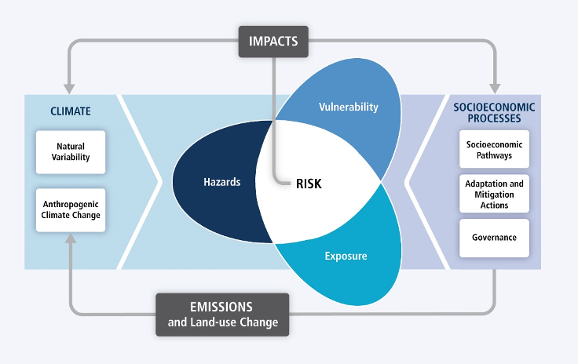

# CBD/COP/DEC/14/5

30 November 2018

## 14/5. Biodiversity and climate change

_The Conference of the Parties,_

_Recognizing_ the critical role of biodiversity and ecosystem functions and services for human well‑being,

_Recalling_ Article 2 of the Paris Agreement,[^1]

_Deeply concerned_ that failing to hold the increase in the global average temperature to well below 2°C above pre-industrial levels would place many species and ecosystems with limited adaptive capacity as well as the people that depend on their functions and services, especially indigenous peoples and local communities and rural women, under very high risk,

_Deeply concerned also_ that escalating destruction, degradation and fragmentation of ecosystems would reduce the capacity of ecosystems to store carbon and lead to increases in greenhouse gas emissions, reduce the resilience and stability of ecosystems, and make the climate change crisis ever more challenging,

_Recognizing_ that climate change is a major and growing driver of biodiversity loss, and that biodiversity and ecosystem functions and services, significantly contribute to climate change adaptation, mitigation and disaster risk reduction,

_Recognizing_ that, limiting the global average temperature increase to 1.5°C compared to 2°C above pre-industrial levels would reduce the negative impacts on biodiversity and on the people that depend on ecosystem functions and services, especially indigenous peoples and local communities and rural women, especially in the most vulnerable ecosystems, such as wetlands, small islands, and coastal, marine and Arctic ecosystems,

1. Adopts the voluntary guidelines for the design and effective implementation of ecosystem-based approaches to climate change adaptation and disaster risk reduction, contained in the annex to the present decision;

2. _Encourages_ Parties, other Governments and relevant organizations, taking into account domestic priorities, circumstances and capabilities, to make use of the voluntary guidelines, in line with the ecosystem approach,[^2] when designing and implementing ecosystem-based approaches to climate change adaptation and disaster risk reduction, recognizing that this may also jointly contribute to climate change mitigation;

3. Also encourages Parties, other Governments and relevant organizations, when undertaking the design, implementation and monitoring of ecosystem-based approaches to climate change adaptation and disaster risk reduction:

   (a) To conduct such activities, recognizing that the effects of climate change are disproportionate, with the full and effective participation of indigenous peoples and local communities, women, youth and elders, appropriately recognizing and supporting the governance, management and conservation of the territories and areas of indigenous peoples and local communities, and, as appropriate, in coordination with the Local Communities and Indigenous Peoples Platform;[^3]

   (b) To encourage activities at the local level led by indigenous peoples and local communities, including consideration and integration of indigenous and traditional knowledge, practices, plans and institutions; subject to the free, prior and informed consent of indigenous peoples and local communities, as appropriate, and consistent with national policies, regulations and national circumstances;

   (c) To ensure that the activities do not contribute to the drivers of biodiversity loss or ecosystem degradation, or negatively affect the indigenous peoples and local communities that depend on ecosystem functions and services;

   (d) To take into account transboundary approaches at the regional level;

   (e) To enhance synergies among different policies and implementation strategies;

   (f) To engage broadly with civil society organizations, the private sector and other key actors:

   (g) To encourage, where relevant, activities at the local level which support vulnerable groups, including women, youth and the elderly;

   (h) To strengthen protected area management effectiveness and conservation of natural ecosystems, including the biodiversity conservation approaches of indigenous peoples and local communities;

   (i) To consider the key messages outlined in annex I to the report of the workshop on "Biodiversity and climate change: integrated science for coherent policy";[^4]

   (j) To strengthen ecosystem integrity for the conservation of natural ecosystems;

4. _Encourages_ Parties, pursuant to decisions [IX/16](https://www.cbd.int/decisions/cop/09/16), [X/33](https://www.cbd.int/decisions/cop/10/33), [XII/20](https://www.cbd.int/decisions/cop/12/20), [XIII/4](https://www.cbd.int/decisions/cop/13/04) and [XIII/5](https://www.cbd.int/decisions/cop/13/05), to further strengthen their efforts:

   (a) To identify regions, ecosystems and components of biodiversity that are or will become vulnerable to climate change at a geographic scale and assess the current and future risks and impacts on biodiversity and biodiversity-based livelihoods, considering the use of biodiversity models and scenarios, as appropriate, while taking into account their important contribution to climate change adaptation and disaster risk reduction;

   (b) To integrate climate change issues and related national priorities into national biodiversity strategies and action plans and to integrate biodiversity and ecosystem integrity considerations into national policies, strategies and plans on climate change, such as nationally determined contributions, as appropriate, and national climate change adaptation planning, in their capacity as national instruments for the prioritization of actions for mitigation and adaptation;

   (c) To promote ecosystem restoration and sustainable management post-restoration;

   (d) To take appropriate actions to address and reduce the negative impacts of climate change;

   (e) To enhance the positive and minimize the negative impacts of climate change mitigation and adaptation activities on ecosystem functions and services, biodiversity and biodiversity-based livelihoods;

   (f) To put in place systems and/or tools to monitor and assess the impacts of climate change on biodiversity and biodiversity-based livelihoods, in particular livelihoods of indigenous peoples and local communities, as well as to assess the effectiveness of ecosystem-based approaches for adaptation, and mitigation and disaster risk reduction;

   (g) To include information on the above in their reports to the Convention;

5. Also encourages Parties and other Governments:

   (a) To foster a coherent, integrated and co-beneficial implementation of the actions under the United Nations Framework Convention on Climate Change and its Paris Agreement,[^5] the 2030 Agenda for Sustainable Development,[^6] the Convention on Biological Diversity, including the Strategic Plan for Biodiversity 2011-2020[^7] and the future post-2020 global biodiversity framework, the United Nations Convention to Combat Desertification, and other relevant international frameworks, such as the Sendai Framework for Disaster Risk Reduction 2015-2030,[^8] where appropriate;

   (b) To integrate ecosystem-based approaches when updating their nationally determined contributions, where appropriate, and pursuing domestic climate action under the Paris Agreement, taking into account the importance of ensuring the integrity and functionality of all ecosystems, including oceans, and the protection of biodiversity;

   (c) To take into consideration, in the design of ecosystem-based adaptation tools and disaster risk reduction, the needs and strategic interests of vulnerable groups, such as women, the elderly, and indigenous peoples and local communities, among others;

6. Welcomes the assessment by the Intergovernmental Science-Policy Platform on Biodiversity and Ecosystem Services on land degradation and restoration, and its regional assessments on biodiversity and ecosystem services, and endorses its key messages that support achieving the Sustainable Development Goals through the use of ecosystem-based approaches to climate change adaptation and mitigation, disaster risk reduction, and combating land degradation, clearly showing how the achievement of the Sustainable Development Goals, the Strategic Plan for Biodiversity 2011-2020 and the Paris Agreement depend on the environment in all its diversity and complexity;

7. Notes with concern the findings of the report entitled Global Warming of 1.5°C, an IPCC special report on the impacts of global warming of 1.5°C above pre-industrial levels and related global greenhouse gas emission pathways, in the context of strengthening the global response to the threat of climate change, sustainable development, and efforts to eradicate poverty,[^9] and encourages Parties to take into account the key findings that support ecosystem-based approaches to climate change adaptation, mitigation and disaster risk reduction;

8. _Encourages_ Parties to collaborate on the conservation, restoration and wise/sustainable use of wetlands so that their importance, within the context of climate change and disaster risk reduction, is recognized, and to support the process towards developing a joint declaration of multilateral environmental agreements with respect to peatland conservation, restoration and wise use, thereby safeguarding the multiple benefits of peatlands, including restored peatlands, and contributing to the Sustainable Development Goals;

9. _Invites_ Parties to provide information on activities carried out to implement the "voluntary guidelines for the design and effective implementation of ecosystem-based approaches to climate change adaptation and disaster risk reduction", and the results produced, and to make this information available through the clearing-house mechanism and other relevant platforms;

10. _Invites_ organizations, including the Friends of Ecosystem-based Adaptation and the Partnership for Environment and Disaster Risk Reduction, and their respective members, to continue to support Parties in their efforts to promote ecosystem-based approaches to climate change adaptation and disaster risk reduction and the approaches to climate change adaptation and disaster risk reduction of indigenous peoples and local communities;

11. Requests the Executive Secretary, subject to the availability of resources, and _invites_ Parties, other Governments and international organizations in a position to do so, to support Parties in undertaking ecosystem-based approaches to climate change adaptation and disaster risk reduction by making use, among other things, of the voluntary guidelines for the design and effective implementation of ecosystem-based approaches to climate change adaptation and disaster risk reduction and by, among other things, at all relevant levels:

    (a) Providing capacity-building and facilitating access to technology, when appropriate;

    (b) Promoting awareness-raising;

    (c) Supporting the use of tools, including community-based monitoring and information systems of indigenous peoples and local communities;

    (d) Supporting, in particular, developing countries, especially least developed countries and small island developing States, taking into account the needs of countries that are most vulnerable to climate change;

    (e) Supporting the development and implementation of pilot projects and upscaling existing projects:

12. _Requests_ the Executive Secretary, in collaboration with Parties, other Governments, the secretariats of relevant multilateral environmental agreements, and other organizations:

    (a) To update, the guidance, tools and information on initiatives available in the voluntary guidelines for the design and effective implementation of ecosystem-based approaches to climate change adaptation and disaster risk reduction,[^10] as necessary, and based on information provided by Parties in accordance with paragraph 9 above;

    (b) To compile case studies at national, regional and international levels on the implementation of ecosystem-based approaches to climate change adaptation and disaster risk reduction:

    (c) To make the above available through the clearing-house mechanism;

13. _Also requests_ the Executive Secretary, in consultation with the Intergovernmental Panel on Climate Change, and subject to the availability of resources:

    (a) To review new scientific and technical information including by taking into account traditional knowledge and the findings of _Global Warming of 1.5°C_, an _IPCC special report on the impacts of global warming of 1.5°C above pre-industrial levels and related global greenhouse gas emission pathways, in the context of strengthening the global response to the threat of climate change, sustainable development, and efforts to eradicate poverty,[^9] with respect to:_

    - (i) The impacts of climate change on biodiversity and on communities that depend on ecosystem services and functions, particularly indigenous peoples and local communities;

    - (ii) The role of ecosystems and their integrity, for climate change adaptation, mitigation and disaster risk reduction, and ecosystem restoration and sustainable land management;

    (b) To prepare a report on potential implications of the above for the work of the Convention for consideration by the Subsidiary Body on Scientific, Technical and Technological Advice at a meeting to be held prior to the fifteenth meeting of the Conference of the Parties;

    (c) To develop targeted messaging on how biodiversity and ecosystem integrity, functions and services contribute to tackle the challenges of climate change;

14. _Further requests_ the Executive Secretary:

    (a) To consider the linkages and interdependencies between biodiversity and climate change in the preparation of the post-2020 global biodiversity framework, informed by the reports and assessments of the Intergovernmental Panel on Climate Change and the Intergovernmental Science-Policy Platform on Biodiversity and Ecosystem Services without prejudice to the process for developing the post-2020 global biodiversity framework, and respecting the mandates of the Convention on Biological Diversity and the United Nations Framework Convention on Climate Change;

    (b) To liaise with the secretariats of relevant multilateral environmental agreements, including the relevant multilateral financial mechanisms, the Joint Liaison Group of the Rio Conventions and the Liaison Group of Biodiversity-related Conventions, to promote synergies and coordinate activities related to climate change adaptation, mitigation, and disaster risk reduction, such as the organization of back-to-back meetings and joint activities, where appropriate;

15. _Invites_ Parties, other Governments, funding organizations and relevant organizations, in a position to do so, to provide support for activities related to ecosystem-based approaches to climate change adaptation and disaster risk reduction.

## Annex

### VOLUNTARY GUIDELINES FOR THE DESIGN AND EFFECTIVE IMPLEMENTATION OF ECOSYSTEM-BASED APPROACHES TO CLIMATE CHANGE ADAPTATION AND DISASTER RISK REDUCTION

#### Table of contents

1. Introduction\*\*

- 1.1. Overview of the Voluntary Guidelines
- 1.2. What are ecosystem-based approaches to climate change adaptation and disaster risk reduction?

2. Principles and safeguards

- 2.1. Principles
- 2.2. Safeguards

3. Overarching considerations for EbA and Eco-DRR design and implementation

- 3.1. Integrating knowledge, technologies, practices and efforts of indigenous peoples and local communities
- 3.2 Mainstreaming EbA and Eco-DRR
- 3.3. Raising awareness and building capacity

4. Stepwise approach to design and implementation of effective EbA and Eco-DRR

- Step A. Understanding the social-ecological system
- Step B. Assessing vulnerabilities and risks
- Step C. Identifying EbA and Eco-DRR options
- Step D. Prioritizing, appraising and selecting EbA and Eco-DRR options
- Step E. Project design and implementation
- Step F. Monitoring and evaluation of EbA and Eco-DRR

#### 1. Introduction

1. Ecosystem-based approaches to climate change adaptation and disaster risk reduction are holistic approaches that use biodiversity, and ecosystem functions and services to manage the risks of climate-related impacts and disasters. Ecosystem-based adaptation (EbA) is the use of biodiversity and ecosystem functions and services, as part of an overall adaptation strategy, contributing to the well-being of societies, including indigenous peoples and local communities, and helping people adapt to the adverse effects of climate change. EbA aims to maintain and increase the resilience and reduce the vulnerability of ecosystems and people in the face of the adverse effects of climate change.[^11]

2. Ecosystem-based disaster risk reduction (Eco-DRR) is the holistic, sustainable management, conservation and restoration of ecosystems to reduce disaster risk, with the aim of achieving sustainable and resilient development.[^12]

3. These voluntary guidelines for the design and effective implementation of ecosystembased approaches to climate change adaptation and disaster risk reduction have been prepared pursuant to paragraph [10](https://www.cbd.int/decisions/cop/13/04/10) of decision [XIII/4](https://www.cbd.int/decisions/cop/13/04). The voluntary guidelines are intended to be used by Parties, other Governments, relevant organizations, and indigenous peoples and local communities, business, the private sector and civil society as a flexible framework for planning and implementing EbA and Eco-DRR. The voluntary guidelines may also contribute to an objective of the national adaptation plan guidelines, under the United Nations Framework Convention on Climate Change, to reduce vulnerability to the impacts of climate change by building resilience and adaptive capacity.

##### 1.1. Overview of the voluntary guidelines

4. The guidelines begin with an overall introduction to the mandate and basic terminology of EbA and Eco-DRR. Section 2 presents principles and safeguards that provide standards and measures to bear in mind during all of the steps of planning and implementation presented in section 4. Section 3 presents other important overarching considerations on: integrating knowledge, technologies, practices and efforts of indigenous peoples and local communities, mainstreaming, and raising awareness and building capacity. The overarching considerations should also be borne in mind when undertaking the steps of planning and implementation in section 4. Section 4 presents a step-wise approach intended to work iteratively for EbA and Eco-DRR planning and implementation, along with suggested practical actions. A supplementary note,[^13] including a primer for policymakers, tools linked with the stepwise process, further detailed actions, advocacy briefs for more effective outreach into sectors, as well as supporting references, glossary, and lists of policies and other relevant guidelines is also available. It also contains a diagram and table to illustrate how the principles, safeguards, overarching considerations, and the stepwise approach work together.

##### 1.2. What are ecosystem-based approaches to climate change adaptation and disaster risk reduction?

5. The Convention on Biological Diversity published Technical Series 85[^14] which presents a synthesis report on experiences with the implementation of EbA and Eco-DRR. It provides detailed information on experiences with policy and legal frameworks, mainstreaming, integrating gender and the contribution of indigenous peoples and local communities. Additional examples of EbA and Eco-DRR activities are presented in the table below.

**Table. Examples of EbA and Eco-DRR interventions and outcomes**[^15]

<table width=100% cellspacing=0 cellpadding=0>
 <thead>
  <tr>
   <td><i>Hazard/climate change impact</i></td>
   <td><i>Ecosystem type</i></td>
   <td><i>EbA or Eco-DRR intervention options</i></td>
   <td><i>Outcome</i></td>
  </tr>
 </thead>
 <tr>
  <td>
  Drought 
  Soil erosion 
  Erratic rainfall
  </td>
  <td rowspan=3>Mountains and forests</td>
  <td rowspan=3>Sustainable mountain wetland management</td>
  <td rowspan=3>
  Improved water regulation 
  Erosion prevention 
  Improved water storage capacity
  </td>
 </tr>
 <tr>
  <td>Forest and pasture restoration</td>
 </tr>
 <tr>
  <td>Restoration of pastures with deep-rooting native species</td>
 </tr>
 <tr>
  <td>
  Erratic rainfall 
  Flood 
  Drought
  </td>
  <td rowspan=3>Inland waters</td>
  <td rowspan=3>Conservation of wetlands and peatlands</td>
  <td rowspan=3>
  Improved water storage capacity 
  Flood risk reduction 
  Improved water provisioning
  </td>
 </tr>
 <tr>
  <td>River basin restoration</td>
 </tr>
 <tr>
  <td>Transboundary water governance and ecosystem restoration</td>
 </tr>
 <tr>
  <td rowspan=5>
  Erratic rainfall 
  Temperature increase 
  Shift of seasons 
  Drought
  </td>
  <td rowspan=5>Agriculture and drylands</td>
  <td>Ecosystem restoration and agroforestry</td>
  <td rowspan=5>
  Improved water storage capacity 
  Adaptation to higher temperatures 
  Adaptation to shifting seasons 
  Improved water provisioning
  </td>
 </tr>
 <tr>
  <td>Intercropping of adapted species</td>
 </tr>
 <tr>
  <td>Using trees to adapt to changing dry seasons</td>
 </tr>
 <tr>
  <td>Sustainable livestock management and pasture restoration</td>
 </tr>
 <tr>
  <td>Drought resilience by sustainable dryland management</td>
 </tr>
 <tr>
  <td rowspan=4>
  Extreme heat 
  Temperature increase 
  Floods 
  Erratic rainfall
  </td>
  <td rowspan=4>Urban</td>
  <td>Green aeration corridors for cities</td>
  <td rowspan=4>
  Heat wave buffering 
  Adaptation to higher temperatures 
  Flood risk reduction 
  Improved water regulation
  </td>
 </tr>
 <tr>
  <td>Storm water management by green spaces</td>
 </tr>
 <tr>
  <td>River restoration in urban areas</td>
 </tr>
 <tr>
  <td>Green facades for buildings</td>
 </tr>
 <tr>
  <td rowspan=4>
  Storm surges 
  Cyclones 
  Sea level rise 
  Salinization 
  Temperature increase 
  Ocean acidification
  </td>
  <td rowspan=4>Marine and coastal</td>
  <td>Mangrove restoration and coastal protection</td>
  <td rowspan=4>
  Storm and cyclone risk reduction 
  Flood risk reduction 
  Improved water quality 
  Adaptation to higher temperatures
  </td>
 </tr>
 <tr>
  <td>Coastal realignment</td>
 </tr>
 <tr>
  <td>Sustainable fishing and mangrove rehabilitation</td>
 </tr>
 <tr>
  <td>Coral reef restoration</td>
 </tr>
</table>

6. EbA and Eco-DRR have the following characteristics:

   (a) Enhance resilience and adaptive capacity and reduce social and environmental vulnerabilities in the face of the risks associated with the impacts of climate change, contributing to incremental and transformative adaptation and disaster risk reduction;

   (b) Generate societal benefits, contributing to sustainable and resilient development using equitable, transparent and participatory approaches;

   (c) Make use of biodiversity and ecosystem functions and services through sustainably managing, conserving and restoring ecosystems;

   (d) Form part of overall strategies for adaptation and risk reduction that are supported by policies at multiple levels, and encourage equitable governance while enhancing capacity.

#### 2. Principles and safeguards

7. The voluntary guidelines are underpinned by principles and safeguards that were developed by reviewing existing literature and guidelines on EbA and Eco-DRR[^16] and complement other principles and guidelines[^17] adopted under the Convention or under other bodies. The safeguards are social and environmental measures to avoid unintended consequences of EbA and Eco-DRR to people, ecosystems and biodiversity; they also facilitate transparency throughout all stages of planning and implementation, and promote the realization of benefits.

##### 2.1. Principles

8. The principles integrate elements of EbA and Eco-DRR practice and serve as high-level standards to guide planning and implementation. They are clustered into themes: building resilience and enhancing adaptive capacity, inclusivity and equity, consideration of multiple scales, and effectiveness and efficiency. The guidelines in section 3 provide suggested steps, methodologies and associated tools to implement actions on EbA and Eco-DRR according to the principles and safeguards.

---

**Principles for building resilience and enhancing adaptive capacity through EbA and Eco-DRR**

1. Consider a full range of ecosystem-based approaches to enhance resilience of social-ecological systems as a part of overall adaptation and disaster risk reduction strategies.

2. Use disaster response as an opportunity to build back better for enhancing adaptive capacity and resilience[^18] and integrate ecosystem considerations throughout all stages of disaster management.

3. Apply a precautionary approach[^19] in planning and implementing EbA and Eco-DRR interventions.

**Principles for ensuring inclusivity and equity in planning and implementation**

4. Plan and implement EbA and Eco-DRR interventions to prevent and avoid the disproportionate impacts of climate change and disaster risk on ecosystems as well as vulnerable groups, indigenous peoples and local communities, women and girls.

**Principles for achieving EbA and Eco-DRR on multiple scales**

5. Design EbA and Eco-DRR interventions at the appropriate scales, recognizing that some EbA and Eco-DRR benefits are only apparent at larger temporal and spatial scales.

6. Ensure that EbA and Eco-DRR are sectorally cross-cutting and involve collaboration, coordination, and cooperation of stakeholders and rights holders.

**Principles for EbA and Eco-DRR effectiveness and efficiency**

7. Ensure that EbA and Eco-DRR interventions are evidence-based, integrate indigenous and traditional knowledge, where available, and are supported by the best available science, research, data, practical experience, and diverse knowledge systems.

8. Incorporate mechanisms that facilitate adaptive management and active learning into EbA and
   Eco-DRR, including continuous monitoring and evaluation at all stages of planning and implementation.

9. Identify and assess limitations and minimize potential trade-offs of EbA and Eco-DRR interventions.

10. Maximize synergies in achieving multiple benefits, including for biodiversity, conservation, sustainable development, gender equality, health, adaptation, and risk reduction.

---

##### 2.2 Safeguards

<table width=100% cellspacing=0 cellpadding=0>
 <thead>
  <tr>
   <td colspan=2><b>Safeguards for effective planning and implementation of EbA and Eco-DRR</b></td>
  </tr>
 </thead>
 <tr>
  <td><i>Applying environmental impact assessments and robust monitoring and evaluation</i></td>
  <td>1. EbA and Eco-DRR should be subject, as appropriate, to environmental impact assessments including social and cultural assessments (referring to the Akwé: Kon guidelines) at the earliest stage of project design, and subject to robust monitoring and evaluation systems.</td>
 </tr>
 <tr>
  <td><i>Prevention of transfer of risks and impacts</i></td>
  <td>2. EbA and Eco-DRR should avoid adverse impacts on biodiversity or people, and should not result in the displacement of risks or impacts from one area or group to another.</td>
 </tr>
 <tr>
  <td rowspan=2><i>Prevention of harm to biodiversity, ecosystems, and ecosystem functions and services</i></td>
  <td>3. EbA and Eco-DRR, including disaster response, recovery and reconstruction measures, should avoid the degradation of natural habitat, loss of biodiversity or the introduction of invasive species, and should not create or exacerbate vulnerabilities to future disasters.</td>
 </tr>
 <tr>
  <td>
  4. EbA and Eco-DRR should promote and enhance biodiversity and ecosystem functions and services, including through rehabilitation/restoration and conservation measures, as part of post-disaster needs assessment and recovery and reconstruction plans.</td>
 </tr>
 <tr>
  <td><i>Sustainable resource use</i></td>
  <td>5. EbA and Eco-DRR should neither result in unsustainable resource use nor enhance the drivers of climate change and disaster risks, and should strive to maximize energy efficiency and minimize material resource use.</td>
 </tr>
 <tr>
  <td><i>Promotion of full, effective and inclusive participation</i></td>
  <td>6. EbA and Eco-DRR should ensure full and effective participation of the people concerned, including indigenous peoples and local communities, women, minorities and the most vulnerable, including the provisioning of adequate opportunities for informed involvement.</td>
 </tr>
 <tr>
  <td><i>Fair and equitable access to benefits</i></td>
  <td>7. EbA and Eco-DRR should promote fair and equitable access to benefits and should not exacerbate existing inequities, particularly with respect to marginalized or vulnerable groups. EbA and Eco-DRR interventions should meet national labour standards, protecting participants against exploitative practices, discrimination and work that is hazardous to their well-being.</td>
 </tr>
 <tr>
  <td><i>Transparent governance and access to information</i></td>
  <td>8. EbA and Eco-DRR should promote transparent governance by supporting rights to access to information, providing all stakeholders and rights holders, particularly indigenous peoples and local communities, with information in a timely manner, and supporting the further collection and dissemination of knowledge.</td>
 </tr>
 <tr>
  <td><i>Respecting rights of women and men from indigenous peoples and local communities</i></td>
  <td>9. EbA and Eco-DRR measures should respect the rights of women and men from indigenous peoples and local communities, including access to and use of physical and cultural heritage.</td>
 </tr>
</table>

#### 3. Overarching considerations for EbA and eco-DRR design and implementation

9. When undertaking the stepwise process for planning and implementing EbA and Eco-DRR provided in section 4, there are three main overarching considerations to bear in mind at each step: integrating knowledge, technologies, practices and efforts of indigenous peoples and local communities; mainstreaming of EbA and Eco-DRR; and raising awareness and building capacity. Taking these actions into account can enhance uptake of EbA and Eco-DRR approaches, and improve effectiveness and efficiencies, enabling more and better outcomes from the interventions.

##### 3.1. Integrating knowledge, technologies, practices and efforts of indigenous peoples and local communities

10. Indigenous peoples and local communities have managed variability, uncertainty and change through multigenerational histories of interaction with the environment. Indigenous and traditional knowledge and coping strategies can thus form an important basis for climate change and disaster risk reduction responses, complementing established evidence, and bridging gaps in information. Indigenous, traditional and local knowledge systems – and forms of analysis and documentation, such as community mapping – can play a significant role, similarly to early warning systems, in identifying and monitoring climatic, weather and biodiversity changes and impending natural hazards. Ecosystem-based approaches can also serve to bring back abandoned practices, such as indigenous and traditional agricultural practices. Integrating the knowledge of indigenous peoples and local communities also involves an appreciation of their cosmovisión,[^20] and an acknowledgement of their role as knowledge holders and rights holders. Ways to incorporate indigenous and traditional knowledge and practices in EbA and Eco-DRR planning and implementation throughout all stages of planning and implementation include the following:

**Key actions**

(a) Discover and document linkages between local, indigenous and traditional knowledge and practices and the goals and objectives of climate change adaptation and disaster risk reduction;

(b) Consult multi-stakeholder working groups, especially indigenous peoples and local communities, to facilitate knowledge-sharing across sectors on the role of ecosystems in adaptation and disaster risk reduction;

(c) Put in place effective participatory and transparent mechanisms to obtain the best available evidence;

(d) Integrate the knowledge of indigenous peoples and local communities into assessments after obtaining free prior and informed consent.

##### 3.2. Mainstreaming EbA and Eco-DRR

**Purpose**

11. Mainstreaming EbA and Eco-DRR is the integration of ecosystem-based approaches into climate- and disaster-risk planning and decision-making processes at all levels. Mainstreaming may start with integrating ecosystem considerations into adaptation and disaster-risk reduction objectives, strategies, policies, measures or operations so that they become part of national and regional development policies, processes and budgets at all levels and stages. Mainstreaming enhances the effectiveness, efficiency, and longevity of EbA and Eco-DRR initiatives by embedding their principles into local, municipal and national policies, planning, assessments, financing, training, and awareness campaigns, among other policy tools. The overall goal is enhanced support and implementation of EbA and Eco-DRR, where it proves effective.

12. Mainstreaming occurs continuously throughout EbA and Eco-DRR planning and implementation. The process begins in Step A with the achievement of a broad understanding of the political and institutional set-up of the target system, which enables the identification of potential entry points for mainstreaming. Other key components of mainstreaming include enhancing sectoral outreach, raising awareness, and capacity‑building.

13. When mainstreaming EbA and eco-DRR, it is important to align with national and subnational development frameworks and mainstream into relevant plans, policies and practice at multiple scales in order to enhance long-term sustainability and possibilities for funding (Figure 1 and Box 1). It is also important to align with international frameworks and conventions, such as the Sustainable Development Goals and the [Strategic Plan for Biodiversity 2011-2020](https://www.cbd.int/sp/). It is also important to incorporate a climate and disaster risk reduction lens, when implementing environmental impact assessments and strategic environmental assessments, to prevent unintended impacts that may exacerbate risk and promote EbA and Eco-DRR measures.
14. A sample framework for mainstreaming is shown in Figure 1. Tools and further detailed actions accompanying this step are available as supplementary information in the "Toolbox for mainstreaming adaptation and DRR".[^21]

**Figure 1. Example framework for mainstreaming EbA and Eco-DRR in development planning**

<table width=100% cellspacing=0 cellpadding=0>
<tr>
  <td colspan=3><b>Multi-stakeholder and multi-sectoral engagement</b></td>
</tr>
<tr>
  <td><b>Finding the Entry Points and Making the Case</b></td>
  <td><b>Mainstreaming EbA and Eco-DRR in Policy and Planning Processes</b></td>
  <td><b>Strengthening EbA Implementation</b></td>
</tr>
<tr>
  <td>
    <ul>
      <li>Understanding social-ecological systems and integrating knowledge, technologies, practices and efforts of IPLCs</li>
      <li>Understanding the political, governmental, institutional contexts</li>
      <li>Raising awareness and building partnerships</li>
      <li>Evaluating institutional and capacity needs</li>
    </ul>
  </td>
  <td>
    <ul>
      <li>Risk and vulnerability assessments, socioeconomic analyses</li>
      <li>Influencing national, subnational and sectoral policy planning and processes</li>
      <li>Developing EbA and Eco-DRR enabling policy measures</li>
      <li>Strengthening institutions and capacities; learning-by-doing</li>
    </ul>
  </td>
  <td>
    <ul>
      <li>Strengthening EbA and Eco-DRR monitoring systems</li>
      <li>Promoting investments in EbA and Eco-DRR</li>
      <li>Strengthening supporting national, subnational and sectoral policy measures</li>
      <li>Strengthening institutions and capacities: Mainstreaming as standard practices</li>
    </ul>
  </td>
</tr>
</table>

_Note_: Adapted from: World Wildlife Fund (2013), _[Operational Framework for Ecosystem based Adaptation: Implementing and Mainstreaming Ecosystem-based Adaptation Responses in the Greater Mekong Sub-Region](http://awsassets.panda.org/downloads/wwf_wb_eba_project_2014_gms_ecosystem_based_adaptation_general_framework.pdf)_; and UNDP-UNEP (2011), _[Mainstreaming Climate Change Adaptation into Development Planning: A Guide for Practitioners](http://www.undp.org/content/undp/en/home/librarypage/environment-energy/climate_change/adaptation/mainstreaming_climatechangeadaptationintodevelopmentplanningagui.html)_.

15. A key aspect of mainstreaming is finding appropriate entry points for integrating EbA and Eco-DRR into concrete but often also complex policy and planning frameworks and decisionmaking processes. Entry points can be dynamic, depending on three key aspects:

    (a) The awareness of stakeholders about an existing problem, challenge or risk;

    (b) Available solutions, proposals, tools and knowledge;

    (c) Political will to act, mandates and roles.

16. If all three aspects come together in favourable ways, there is a "momentum" for policy change. In cases of disaster and states of emergency, there is generally openness towards stakeholders' needs, innovative tools and approaches, joint searches for best available solutions, and a willingness to invest and (re)build better. These are important opportunities to include EbA or Eco-DRR aspects. Entry points may occur at all levels of government, and can imply different levels of governance, or collaboration with the private sector.

17. In general, entry points for mainstreaming may be found in:

    (a) The development or revision of policies and plans, e.g. development or sectoral plans, nationally determined contributions, as appropriate, national adaptation plans, national biodiversity strategies and action plans, strategic environmental assessments, land-use plans;

    (b) Command and control instruments, e.g. climate change and environmental laws, standards, environmental impact assessments, and disaster risk management;

    (c) Economic and fiscal instruments, e.g. investment programmes, funds, subsidies, taxes, fees;

    (d) Educational and awareness-raising measures, e.g. environmental education, extension programmes, technical careers and university curricula;

    (e) Voluntary measures, e.g. environmental agreements with private landowners, or the definition of standards;

    (f) Measures that guarantee the free prior informed consent, of indigenous peoples, where appropriate;

    (g) Partnerships that enable the full and effective participation of civil society organizations, indigenous peoples and local communities, women and youth.

18. As emphasized throughout the EbA/Eco-DRR planning and implementation process, reaching out to sectors is key to raising awareness of and integrating EbA and Eco-DRR into sectoral plans and national-level planning, and encouraging cross-sectoral collaboration for joint implementation.

---

**Box 1. Opportunities for mainstreaming EbA and Eco-DRR into funding priorities**

EbA and Eco-DRR contribute to multiple objectives, including development, disaster risk, adaptation, mitigation, food and water security, and to ensuring risk-informed investments. The cross-sectoral and transdisciplinary approaches of EbA and Eco-DRR, and the potential realization of multiple benefits, offer several opportunities to attract/enhance funding.

- Encourage new financial incentives for investments in sustainable ecosystem management that emphasize ecosystems as part of adaptation and disaster risk planning. Examples include developing incentive programmes for farmers to implement practices that contribute to maintaining resilient ecosystems, such as agroforestry and conservation tillage.

- Unlock new investments for EbA and Eco-DRR through the climateproofing of existing investment portfolios.

- Work with the private sector (including insurance, tourism, agriculture and water sectors) to harness their expertise, resources and networks. This helps in encouraging and scaling up investments in EbA and Eco-DRR, and identifying public-private partnerships.

- Engage government regulatory bodies to support and endorse privatesector investments in natural infrastructure and EbA and Eco-DRR.

- Identify partnerships with industry associations that can aid in the identification of climate risks, impacts and adaptation strategies. Examples include the development of climate risk assessment tools for use by private-sector investors and insurance companies, adoption of hydro-meteorological and climate information services, and working with developers to improve land-use planning, including such EbA and Eco-DRR activities as ecosystem restoration.

- Create national-level incentive structures for EbA/Eco-DRR, especially for private landowners and companies.

The mainstreaming of EbA and Eco-DRR into funding priorities should ensure that initiatives adhere to the EbA and Eco-DRR principles and safeguards, with clear intentions to achieve enhanced social-ecological resilience to climate change impacts and disasters.

---

19. A key action in this respect is to consider integrating EbA and Eco-DRR in sectoral development plans at local, national and regional scales, such as in land use and water management, in both rural and urban contexts. Additional detailed actions, as well as briefs for supporting EBA and Eco-DRR practitioners to undertake outreach into sectors are provided as supplementary information tools. [^22]

20. Considering the information provided above, a simple framework for mainstreaming EbA and Eco-DRR into development and sectoral plans is presented as supplementary information[^23] in Figure 2.

**Figure 2. Entry points for mainstreaming EbA and Eco-DRR within key development and sectoral strategies by embedding ecosystem-based approaches into existing instruments and methods tools, selecting appropriate indicators for monitoring and evaluation, ensuring successful impact by developing a theory of change**

##### 3.3. Raising awareness and building capacity

21. Communicating the multiple benefits of EbA and Eco-DRR across sectors, communities of practice, and disciplines is crucial to enhancing uptake and sustainability of initiatives, in addition to opening avenues for funding. National and international policy agreements provide an opportunity to bridge the gap between different communities of practice. Interlinkages between ecosystem management, climate change and disaster risk reduction are all reflected in various targets under the Sustainable Development Goals, the Sendai Framework for Disaster Risk Reduction, the Paris Agreement on Climate Change, decisions of the Parties to the Rio conventions, and resolutions of Parties to the Ramsar Convention.[^24]

22. A detailed list of suggested actions to raise awareness and build capacity is provided as supplementary information.[^25] Some key actions include conducting baseline assessments of: (a) the existing skills and capacity of policymakers to address gaps and needs; and (b) institutional capacities and existing coordination mechanisms to identify needs for sustainably mainstreaming and implementing EbA and Eco-DRR. It is also useful to consider the different information and communication needs of different stakeholder groups in order to develop effective outreach, build a common knowledge base and seek to identify a common language among stakeholders to support their cooperation. There are many networks available to support these efforts and which offer platforms for sharing information and experience.[^26]

#### 4. Stepwise approach to design and implementation of effective EbA and Eco-DRR

23. In developing a conceptual framework for these guidelines, various climate change adaptation and disaster risk reduction processes were considered, in addition to broader problem-solving approaches, such as the landscape and systems approach frameworks.[^27] [^28] These guidelines employ a broad perspective on all ecosystems and include considerations for mainstreaming EbA and Eco-DRR. The guidelines integrate these approaches within a series of iterative steps. The process is intended to be flexible and adaptable to the needs of a project, programme or country, region, or landscape/seascape. The principles and safeguards for EbA and Eco-DRR are central to the planning and implementation process, and the overarching considerations are provided to improve effectiveness and efficiencies. Steps are linked to a toolbox providing a non-exhaustive selection of further guidance and tools available as supplementary information.[^29] Stakeholder engagement, mainstreaming, capacity-building, and monitoring should be conducted throughout the process.

##### Step A. Understanding the social-ecological system

**Purpose**

24. This exploratory step is aimed at enhancing the understanding of the social-ecological system targeted for climate change adaptation and disaster risk management interventions. This includes identifying key features of the ecosystem/landscape, including biodiversity and ecosystem functions and services, and interlinkages with people. Step A enables addressing root causes of risk in coping with current and future climate change impacts. Additionally, it generates baseline information to ensure that EbA/Eco-DRR measures reconcile conservation and development needs and do not harm biodiversity, cultural diversity or ecosystem functions and services, or the people and livelihoods that depend on such functions and services, in line with the principles and safeguards.

25. Moreover, Step A includes in-depth stakeholder analysis and multi-stakeholder and participatory processes that feed into subsequent steps and, therefore, more detailed actions are presented to undertake these analyses (Box 2).

**Outcome**

(a) A defined social-ecological system of interest (biodiversity, ecosystems and services, socio-economic characteristics and dependencies) and related goals and objectives for adaptation and disaster risk reduction;

(b) Defined stakeholders and rights holders;

(c) Defined political and institutional entry points for EbA/Eco-DRR within the system.

**Key actions**

(a) Undertake an organizational self-assessment to understand strengths, weaknesses, capacity (including technical and financial) and opportunities for partnership on EbA and Eco-DRR. Based on this, a multi-disciplinary team (including but not limited to indigenous peoples and local communities, other experts, representatives from relevant sectors and government bodies) is organized for planning and implementing EbA and Eco-DRR;

(b) Identify and define the social-ecological system of interest (for example, a watershed, sector or policy);

(c) Conduct analyses and consultations, making use of the multidisciplinary team, in order to understand the drivers of risk, capacities and assets of communities, societies and economies, and the wider social and natural environment;

(d) Analyse the problem, determining its scope (geographical and temporal) by defining the boundaries of the system (see supporting guidance in the associated toolbox[^30]), and set goals and objectives for adaptation and disaster risk reduction, without harm to biodiversity or ecosystem functions and services. The spatial scale for risk management, associated with the impacts of climate change, should be broad enough to address the root causes of risk and deliver multiple functions to stakeholders with different interests, and sufficiently small to make implementation feasible;

(e) Identify and map key provisioning, regulating, supporting and cultural services in the system that contribute to resilience. As 90 per cent of disasters are water-related, including drought or floods, understanding the hydrology of the landscape is crucial for scoping and designing EbA or Eco-DRR interventions;

(f) Determine initial entry points for EbA and Eco-DRR interventions;

(g) Screen relevant entry points for EbA and Eco-DRR, particularly in a policy, planning or budgeting cycle, at different scales and levels, where considerations of climate change risk and adaptation could be incorporated;

(h) Map out the institutional responsibilities for intersections of development, conservation, disaster risk reduction and climate change adaptation, including relevant sectors;

(i) Conduct an in-depth stakeholder analysis (Box 2).

---

**Box 2. Stakeholder and rights-holder analysis and establishment of participatory mechanisms**

An assessment of the system or landscape helps to analyse the problem, define the boundaries for climate change adaptation and disaster risk reduction interventions, and screen for entry points for EbA and Eco-DRR. This information should feed into an in-depth stakeholder analysis before engaging stakeholders throughout the adaptation/DRR process, and also iteratively benefits from information from stakeholders. Engagement of stakeholders and rights holders will increase ownership and likely also the success of any adaptation/DRR intervention. In-depth stakeholder analyses and development of multistakeholder processes and participatory mechanisms are key to meeting principles on equity and inclusivity and related safeguards. The Akwé: Kon Voluntary Guidelines (https://www.cbd.int/traditional/guidelines.shtml) outline procedural considerations for the conduct of cultural, environmental and social impact assessments, which are widely applicable to EbA and Eco-DRR.

**Key Actions**

- Identify indigenous peoples and local communities, stakeholders and rights holders likely to be affected by EbA and Eco-DRR interventions, and identify people, organizations and sectors that have influence over planning and implementation, using transparent participatory processes.

- Ensure full and effective participation of all relevant stakeholders and rights holders, including indigenous peoples and local communities, the poor, women, youth and the elderly, ensuring they have the capacity and sufficient human, technical, financial and legal resources to do so (in line with the safeguards).

- Engage with civil society organizations and/or community-based organizations to enable their effective participation.

- Where appropriate, identify and protect the ownership and access rights to areas for the use of biological resources.

---

##### Step B. Assessing vulnerabilities and risks

**Purpose**

26. Vulnerability and risk assessments are undertaken to identify the main climate change and disaster risks and impacts on the social-ecological system of interest, for example, taking stock of biodiversity and ecosystem service information to identify species or ecosystems that are particularly vulnerable to the negative impacts of climate change. The assessments are then used to identify, appraise and select targeted adaptation and disaster risk reduction interventions in planning and design. Risk and vulnerability assessments also aid in allocating resources to where they are most needed, and in establishing baselines for monitoring the success of interventions.

27. Vulnerability is defined as the propensity or predisposition to be adversely affected. Vulnerability encompasses a variety of concepts and elements, including sensitivity or susceptibility to harm and lack of capacity to cope and adapt.[^31] Vulnerability, exposure and hazards together determine the risks of climate-related impacts (Figure 3). While they have different definitions and underlying assumptions, both risk and vulnerability assessments follow a similar logic.

**Figure 3. Illustration of the core concepts of the contribution of Working Group II to the Fifth Assessment Report of the Intergovernmental Panel on Climate Change**

_Note_: Risk of climate-related impacts results from the interaction of climate-related hazards (including hazardous events and trends) with the vulnerability and exposure of human and natural systems. Changes in both the climate system (left) and socioeconomic processes including adaptation and mitigation (right) are drivers of hazards, exposure and vulnerability (Intergovernmental Panel on Climate Change, _Climate Change 2014: Impacts, Adaptation and Vulnerability, 2014_).

28. Risk assessments generally consist of three steps: risk identification (finding, recognizing and describing risk); risk analysis (estimation of the probability of its occurrence and the severity of the potential impacts); and risk evaluation (comparing the level of risk with risk criteria to determine whether the risk and/or its magnitude is tolerable). These steps consider both climate and non-climate factors that generate a climate or disaster risk.

29. The advantage of an integrated risk and vulnerability assessment approach, as opposed to assessing only vulnerability, is that it addresses the large proportion of impacts that are triggered by hazardous events as well as integrates both climate change adaptation and disaster risk reduction approaches. A relatively new practice is moving from single hazard approaches to multi-hazard/multi-risk assessments. This approach can account for regions or classes of objects exposed to multiple hazards (e.g. storms and floods), and cascading effects, in which one hazard triggers another.

30. Key considerations and general activities for undertaking risk and vulnerability assessments are discussed below. Tools and examples and more detailed stepwise guidance are provided in the Step B Toolbox: Conducting risk and vulnerability assessments, available as supplementary information. [^32]

**Outcome**

(a) A risk and vulnerability profile in current and future climate scenarios of the socialecological system covering hazards, exposure, and vulnerabilities (including sensitivities and adaptive capacities);

(b) Main drivers of risks and underlying causes.

**Key actions**

(a) Develop or make use of frameworks and concepts that recognize the linkages between people and ecosystems as integrated social-ecological systems, rather than viewing adaptation and risk reduction only through a human lens;

(b) Assess past and current climate and non-climate risks to the social-ecological system with flexible criteria that address the linkages between human and environmental systems:

- (i) Consult previous assessments of climate change impacts on biodiversity and ecosystem functions and services; for example, national impact and vulnerability assessments prepared for UNFCCC, or vulnerability assessments from forest, agriculture, fisheries or other relevant sectors;

- (ii) Conduct socioeconomic and ecological field surveys to identify vulnerabilities in both communities and ecosystems (including ecosystems that provide critical functions and services for climate change adaptation or DRR) (see supplementary information for further detail[^33];

- (iii) Assess the drivers of current risks and vulnerability and, if possible, future risks based on climate change projections or scenarios that are at the appropriate scale, e.g. downscaled to the local level, where appropriate;

(c) Integrate quantitative approaches (based on scientific models) and qualitative approaches, which are grounded in expert judgment and indigenous and traditional knowledge (more detail is provided below). For example, use participatory rural appraisals to understand local perceptions and past experiences;

(d) Develop hazard and risk maps, such as through the use of participatory 3-D modelling of risks.

##### Step C. Identifying EbA and Eco-DRR options

**Purpose**

31. Having defined the boundaries of the social-ecological system/landscape and identified initial entry points for EbA and Eco-DRR, as well as vulnerabilities and risks (Step A), potential options are identified by the multi-stakeholder group within an overall strategy of climate change adaptation and disaster risk reduction. A list of relevant tools linked to this step is provided in the Step C Toolbox: Identifying EbA and Eco-DRR Strategies, available as supplementary information.[^34]

**Outcome**

A list of available strategies and options for reducing the exposure and sensitivity of socialecological systems to climate hazards and enhancing adaptive capacity

**Key actions**

(a) Identify existing coping strategies and responses to address the risks of climate change impacts and disasters, and/or those used to address current climate variability and socioeconomic pressures on ecosystems and societies, and analyse viability for future climate impacts and risks;

(b) Refine the initial entry points identified for EbA/Eco-DRR. Criteria for selecting entry points can include:

- (i) High probability of effectiveness from previous experiences in a similar social-ecological setting;

- (ii) Strong support from stakeholders;

(c) In collaboration with multi-stakeholder groups, inclusive of stakeholders, rights holders and experts, formulate appropriate strategies, within an overall adaptation strategy, to address the risks and vulnerabilities identified in Step B;

(d) Assess specific issues and priorities of the vulnerable groups, sectors, and ecosystems;

(e) Ensure that EbA and Eco-DRR are planned at the local, community and household levels and at the landscape or catchment level, as appropriate;

(f) Identify the EbA and Eco-DRR strategies that meet the objectives defined in Step A, and that adhere to its main elements;

(g) Consider the qualification criteria and standards for EbA. [^35]

##### Step D. Prioritizing, appraising and selecting EbA and Eco-DRR options

**Purpose**

32. In this step, the EbA and Eco-DRR options identified in Step C are prioritized, appraised and selected to achieve the goals set out in Step A, as part of an overall adaptation and disaster risk reduction strategy, for the system of interest. A list of relevant tools is provided as supplementary information[^36] in the Step D Toolbox: Prioritizing, appraising and selecting EbA and Eco-DRR options.

33. Given the importance of evaluating trade-offs and limitations, more detailed actions are provided (Box 3). Associated tools are available in the Step D Toolbox: Prioritizing, appraising and selecting adaptation and DRR options and identifying trade-offs available as supplementary information.[^37] Information on ways to increase scientific and technical knowledge of EbA and Eco-DRR approaches are also elaborated within supplementary information.[^38]

**Outcome**

(a) List of prioritized options based on selected criteria;

(b) Selection of final options for implementation.

**Key actions**

(a) Using participatory approaches (Step A), identify the criteria/indicators to be used to prioritize and appraise the EbA and Eco-DRR options identified in Step C. For example, using multi-criteria analysis or cost-effectiveness to evaluate adaptation options;[^39]

(b) Ensure that trade-offs and limitations of options are part of the appraisal process (Box 3), and include consideration of green or hybrid solutions, before grey, when more effective;

(c) Consider multiple values and benefits, including non-monetary, to capture the full value of different EbA and Eco-DRR options;

(d) Assign weights to the proposed criteria, and use the criteria to rank the EbA and Eco-DRR options;

(e) Prioritize and short-list EbA and Eco-DRR options based on the agreed-upon criteria;

(f) Make use of the multi-stakeholder group and consult other rights holders to identify the best options and develop a business case;

(g) Analyse the costs, benefits, impacts and trade-offs of different risk management scenarios, and the costs of inaction, to capture gains or losses in ecosystem functions and services provisioning that have an impact on adaptation and disaster risk reduction and resilience (e.g. consideration for wetlands);

(h) Consider the sustainable use of local ecosystems, services and/or materials in EbA/Eco-DRR options that could bring additional local benefits and reduce carbon emissions from transport, rather than outsourced labour and materials;

(i) In appraising options, consider the costs and benefits of interventions over the long term, as the time period in economic comparison of various options is important, and consider both upfront capital and longer-term maintenance costs. For example, engineered structures, such as dykes, can be relatively inexpensive at the investment level but carry high maintenance costs, whereas ecosystem-based approaches, such as wetland restoration, may be less expensive in the long term and provide multiple benefits;

(j) Assess the strength of proposed EbA and Eco-DRR measures by examining how they adhere to the elements, principles and safeguards, considering available qualification criteria and standards;

(k) Before the design and implementation of selected projects (Step E), conduct environmental impact assessments (EIA) of the recommended options, ensuring that: (i) possible social and environmental impacts have been clearly identified and assessed; (ii) appropriate measures have been taken to avoid or, if not possible, mitigate risks; and (iii) the measures taken to avoid/mitigate risks are themselves monitored and reported on throughout project life cycles. The EIA should incorporate a summary of recommendations from past, ongoing and planned projects and programmes within the relevant geographic jurisdiction.

---

**Box 3. Evaluating trade-offs and limitations**

Part of the process of prioritizing, appraising and selecting adaptation/DRR options involves the identification and evaluation of potential trade-offs. Trade-offs may arise when an activity protects one group of people at the expense of another, or favours a particular ecosystem service over another. Some trade-offs are the result of deliberate decisions; others occur without knowledge or awareness. For example, the implementation of adaptation actions upstream may have effects on downstream communities, and at different times. Ecosystems are subject to climate change and, therefore, EbA, Eco-DRR and other practices that use ecosystem-based approaches should be designed to be robust in the face of current and projected impacts of climate change. Trade-offs and limitations should be considered and integrated within overall adaptation and disaster risk reduction planning and aligned with national policies and strategies. They should also be implemented alongside other measures of risk reduction, including avoidance of high-risk zones, improved building codes, early warning and evacuation procedures. A trade-off analysis across scales and considering multiple benefits can help to favour EbA and Eco-DRR options.

**Key actions**

- Develop indicators of short‑ and long-term changes across various spatial scales to detect potential trade-offs and limitations of EbA and Eco-DRR (see Step F for more detail).

- Use geospatial data and models (such as those available in InVEST (https://www.naturalcapitalproject.org/invest)) to understand how changes in ecosystem structure and function, as a result of adaptation or DRR interventions, will affect ecosystem functions and services across a land- or seascape.

- Consider the full range of infrastructure options from "green" to "hybrid" to "hard" and their compatibility, recognizing that different combinations are needed in different situations.

- Ensure that EbA and Eco-DRR are informed by the best available science and indigenous and traditional knowledge to fully account for possible trade-offs and limitations.

- Ensure the integration of EbA and Eco-DRR into overall adaptation or disaster risk reduction strategies, in recognition of the multiple benefits and potential limitations of ecosystem-based approaches.

- Maximize multiple benefits and consider and minimize trade-offs or unintended consequences of EbA and Eco-DRR throughout all stages of planning and implementation, including accounting for uncertainties in climate projections and for different scenarios.

##### Step E. Project design and implementation

**Purpose**

34. In this step, the interventions selected in Step D are designed and implemented according to the principles and safeguards. Throughout the design and implementation, it is important to continually revisit the principles and safeguards and ensure ongoing stakeholder engagement, capacity-building, mainstreaming and monitoring.

35. Given the added importance of transboundary and cross-sectoral cooperation, coordination and policies, more detailed actions are provided (see Box 4). Associated tools are provided in the Step E toolbox: Project design and implementation, available as supplementary information. [^40]

**Outcome**

A project design and implementation plan (including a finance strategy, capacity development strategy, defined actions for institutional and technical support measures)

**Key actions**

- (a) Consider the EbA and Eco-DRR elements, principles and safeguards throughout design and implementation (See Step B);

- (b) Consider the qualification criteria and standards for EbA;

- (c) Design interventions at the appropriate scale to address the goals set out in Step A;

- (d) Engage relevant experts, and strengthen linkages between the scientific community and project executors to ensure optimal and appropriate use of ecosystems for adaptation and DRR;

- (e) Select appropriate tools and, if needed, plan for the development of new methodologies;

- (f) Determine technical and financing requirements and develop a budget accordingly;

- (g) Establish a workplan, including timelines of activities, milestones to achieve, multistakeholder consultations needed, and allocation of tasks and responsibilities;

- (h) Develop strategies to reduce identified risks and trade-offs and enhance synergies (see Step D);

- (i) Establish linkages between the project and national, subnational, and/or local development plans, strategies, and policies;

- (j) Consider principles for building resilience and adaptive capacity in social-ecological systems (see Box 5).

---

**Box 4. Transboundary and cross-sectoral cooperation, coordination and policies**

Climate change impacts and disaster risks extend beyond political boundaries; therefore, an integrated landscape or systems approach aids in problem-solving across sectors and boundaries. Transboundary cooperation can enable the sharing of costs and benefits and prevent potentially negative impacts of measures taken unilaterally. Transboundary cooperation can also provide opportunities for socioeconomic development and managing issues at appropriate ecosystem scales.

EbA and Eco-DRR interventions increasingly call for cooperation with other sectors, including agriculture, water, urban development and infrastructure.

Transboundary and cross-sectoral considerations can be integrated into EbA and Eco-DRR by:

- Integrating the different scales of critical ecosystem functioning needed for adaptation and disaster risk reduction in EbA and Eco-DRR;

- Greater coherence between regional/transboundary EbA and Eco-DRRstrategies and policies contributes to improved effectiveness of actions;

- Learning from well-established cross-sectoral planning mechanisms, such as integrated water resources management (IWRM), integrated coastal zone management (ICZM) and land-use planning, to strengthen cross-sectoral cooperation and enhance uptake of EbA and Eco-DRR into relevant sectoral frameworks (also applicable to mainstreaming EbA and Eco-DRR);

- Setting up a commission or task group with transboundary partners and sectors; representatives to develop a joint vision, goals and objectives for EbA and Eco-DRR;

- Developing a common understanding of vulnerabilities at the transboundary scale and for different sectors through the use of common models and scenarios and agreed-upon methodologies and sources of information;

- Adopting an iterative monitoring and evaluation process (see Step F) to ensure that transboundary and cross-sectoral EbA and Eco-DRR strategies continue to meet national adaptation and disaster risk reduction targets and maximize the potential for multiple benefits.

---

---

**Box 5. Applying resilience thinking in EbA and Eco-DRR design**

A resilience approach to sustainability focuses on building capacity to deal with unexpected change, such as the impacts of climate change and the risk of disaster. Applying a resilience lens to designing EbA and Eco-DRR interventions involves managing interactions between people and nature, as social-ecological systems, to ensure continued and resilient provisioning of essential ecosystem functions and services that provide adaptation and disaster risk functions. There are seven key principles in applying resilience thinking, distilled from a comprehensive review of different social and ecological factors that enhance the resilience of social-ecological systems and the ecosystem functions and services they provide (Stockholm Resilience Centre, 2014):

- Maintain diversity and redundancy, for example, by maintaining biological and ecological diversity. Redundancy is the presence of multiple components that can perform the same function, can provide "insurance" within a system by allowing some components to compensate for the loss or failure of others.

- Manage connectivity (the structure and strength with which resources, species or actors disperse, migrate or interact across patches, habitats or social domains in a social-ecological system), e.g. by enhancing landscape connectivity to support biodiversity and ecosystem functions and services that contribute to adaptation and risk reduction.

- Manage slowly changing variables and feedbacks (two-way "connectors") between variables that can either reinforce (positive feedback) or dampen (negative feedback) change.

- Foster complex adaptive systems thinking by adopting a systems framework approach (Step A).

- Encourage learning, such as by exploring different and effective modalities for communications.

- Broaden participation, such as by dedicating resources to enable effective participation.

- Promote polycentric governance systems, including through multiinstitutional cooperation across scales and cultures.

##### Step F. Monitoring and evaluation of EbA and Eco-DRR

**Purpose**

36. Monitoring and evaluation (M&E) of EbA and Eco-DRR are critical for assessing progress and efficiency and effectiveness of interventions. Monitoring enables adaptive management and is ideally carried out throughout the lifetime of the intervention. Evaluation assesses an ongoing or completed project, programme or policy, its design, implementation and results. M&E can encourage continual learning to help inform future policy and practice and make corresponding adjustments.

37. There is a movement towards integrating approaches for M&E from both adaptation and disaster risk reduction fields. A myriad of approaches and frameworks have been developed, including logical frameworks and results-based management. Key actions and considerations related to M&E are outlined below.[^41] Tools associated with this step are available in the Step E Toolbox: Monitoring and evaluation of EbA and Eco-DRR, available as supplementary information.[^42]

**Outcome**

A monitoring and evaluation framework that is realistic, operative and iterative, including protocol for data collection and evaluation, and information generated on outcomes and impacts of interventions.

### **Key actions**

(a) Set up an M&E framework, establishing its objectives, audience (who uses the information from an M&E assessment), data collection, mode of dissemination of information, and available technical and financial capacity;

(b) Develop a results/outcomes framework within the M&E framework that details the expected effects of the EbA/Eco-DRR intervention, including short- and medium-term outcomes and long-term results;

(c) Develop indicators at the appropriate temporal and spatial scales to monitor the quantity and quality of change:

- (i) Ensure that monitoring and evaluation include indicators[^43] formulated to the SMART criteria, which are specific, measurable, achievable and attributable, relevant and realistic, time-bound, timely, trackable and targeted and/or the ADAPT principles (Adaptive, Dynamic, Active, Participatory, Thorough);

- (ii) Ensure that indicators are vulnerability- and risk-oriented and focused, and that they are able to measure high risks versus low risks and how EbA/Eco-DRR interventions reduce risk over time. It is important to define "risk layers" and to prioritize which risks should be measured using indicators;

- (iii) Use targets and indicators under the Sustainable Development Goals, Aichi Biodiversity Targets and other relevant frameworks to track progress in sustainable ecosystem management and biodiversity enhancement, which also deliver towards strengthening resilience to climate change impacts and disasters;

- (iv) Alian indicators with existing M&E frameworks where possible;

(d) Determine baselines for assessing effectiveness;

(e) Use appropriate participatory and inclusive tools for monitoring and evaluation of EbA and Eco-DRR, ensuring the engagement of local communities, stakeholders and rights holders.[^44] Ensure the relevant experts are engaged, such as specialists on ecosystems/ species status, and ecosystem function;

(f) Test EbA/Eco-DRR related indicators for local relevance.

[^1]: United Nations, _Treaty Series_, Registration No. I-54113.
[^2]: Decision [VII/11](https://www.cbd.int/decisions/cop/07/11).
[^3]: Established under paragraph 135 of decision 1/CP.21 of the Conference of the Parties to the United Nations Framework Convention on Climate Change (see FCCC/CP/2015/10/Add.1).
[^4]: [CBD/COP/14/INF/22](https://www.cbd.int/documents/CBD/COP/14/INF/22).
[^5]: United Nations, _Treaty Series_, Registration No. I-54113.
[^6]: See General Assembly resolution [70/1](https://docs.un.org/en/A/RES/70/1) of 25 September 2015.
[^7]: Decision [X/2](https://www.cbd.int/decisions/cop/10/02).
[^8]: General Assembly resolution [69/283](https://docs.un.org/en/A/RES/69/283), annex II.
[^9]: Intergovernmental Panel on Climate Change, 2018. Available at http://www.ipcc.ch/report/sr15/.
[^10]: [CBD/SBSTTA/22/INF/1](https://www.cbd.int/documents/CBD/SBSTTA/22/INF/1).
[^11]: Derived from CBD Technical Series 41. 2009. Connecting Biodiversity and Climate Change Mitigation and Adaptation: Report of the Second Ad Hoc Technical Expert Group on Biodiversity and Climate Change.
[^12]: Estrella, M. and N. Saalismaa. 2013. Ecosystem-based Disaster Risk Reduction: An Overview, In: Renaud, F., Sudmeier-Rieux, K. and M. Estrella (eds.), _The Role of Ecosystem Management in Disaster Risk Reduction_. Tokyo: UNU Press.
[^13]: [CBD/SBSTTA/22/INF/1](https://www.cbd.int/documents/CBD/SBSTTA/22/INF/1).
[^14]: Synthesis Report on Experiences with Ecosystem-Based Approaches to Climate Change Adaptation and Disaster Risk Reduction (https://www.cbd.int/doc/publications/cbd-ts-85-en.pdf).
[^15]: Source: PANORAMA database https://panorama.solutions/en/portal/ecosystem-based-adaptation.
[^16]: Including "Guidance on Enhancing Positive and Minimizing Negative Impacts on Biodiversity of Climate Change Adaptation Activities" ([UNEP/CBD/SBSTTA/20/INF/1](https://www.cbd.int/documents/UNEP/CBD/SBSTTA/20/INF/1)).
[^17]: See Ecosystem restoration: short-term action plan (decision [XIII/5](https://www.cbd.int/decisions/cop/13/05)); the United Nations Declaration on the Rights of Indigenous Peoples; and Principles, Guidelines and Other Tools Developed under the Convention, available at https://www.cbd.int/quidelines/.
[^18]: The use of the recovery, rehabilitation and reconstruction phases after a disaster to increase the resilience of nations and communities through integrating disaster risk reduction measures into the restoration of physical infrastructure and societal systems, and into the revitalization of livelihoods, economies and the environment (UNISDR definition of "build back better", 2017, as recommended by the open-ended intergovernmental expert working group on terminology relating to disaster risk reduction ([A/71/644](https://docs.un.org/en/A/RES/71/644) and Corr.1) and endorsed by the United Nations General Assembly (see resolution [71/276](https://docs.un.org/en/A/RES/71/276))).
[^19]: The precautionary approach is stated in the preamble of the Convention on Biological Diversity: "Where there is a threat of significant reduction or loss of biological diversity, lack of full scientific certainty should not be used as a reason for postponing measures to avoid or minimize such a threat."
[^20]: A worldview that has evolved over time that integrates physical and spiritual aspects (adapted from the Indigenous Peoples' Restoration Network).
[^21]: [CBD/SBSTTA/22/INF/1](https://www.cbd.int/documents/CBD/SBSTTA/22/INF/1).
[^22]: [CBD/SBSTTA/22/INF/1](https://www.cbd.int/documents/CBD/SBSTTA/22/INF/1).
[^23]: Ibid.
[^24]: [CBD/SBSTTA/22/INF/1](https://www.cbd.int/documents/CBD/SBSTTA/22/INF/1), annex; CBD Technical Series No. 85, annexes II and III.
[^25]: [CBD/SBSTTA/22/INF/1](https://www.cbd.int/documents/CBD/SBSTTA/22/INF/1).
[^26]: Such as the Partnership for Environment and Disaster Risk Reduction (PEDRR), Friends of EbA (FEBA), PANORAMA, BES-Net (Biodiversity and Ecosystem Services Network), Ecoshape, Ecosystem Services Partnership's Thematic Working Group on Ecosystem Services and Disaster Risk Reduction, IUCN Thematic Groups, and CAP-Net (UNDP).
[^27]: Including: National adaptation plans (UNFCCC), Operational Framework for EbA (WWF), Adaptation mainstreaming cycle (GIZ), Disaster risk management cycle (European Environmental Agency), Eco-DRR cycle (Sudmeier-Rieux 2013), Ecosystems protecting infrastructure and communities (IUCN, Monty et al. 2017), and the Landscape Approach (CARE Netherlands and Wetlands International).
[^28]: Additional details are provided in [CBD/SBSTTA/22/INF/1](https://www.cbd.int/documents/CBD/SBSTTA/22/INF/1).
[^29]: [CBD/SBSTTA/22/INF/1](https://www.cbd.int/documents/CBD/SBSTTA/22/INF/1).
[^30]: Available in [CBD/SBSTTA/22/INF/1](https://www.cbd.int/documents/CBD/SBSTTA/22/INF/1).
[^31]: Intergovernmental Panel on Climate Change, Fifth Assessment Report, 2014.
[^32]: See [CBD/SBSTTA/22/INF/1](https://www.cbd.int/documents/CBD/SBSTTA/22/INF/1).
[^33]: Ibid.
[^34]: Available in [CBD/SBSTTA/22/INF/1](https://www.cbd.int/documents/CBD/SBSTTA/22/INF/1).
[^35]: See "Making Ecosystem-based Adaptation Effective – A Framework for Defining Qualification Criteria and Quality Standards" (FEBA Technical Paper).
[^36]: See [CBD/SBSTTA/22/INF/1](https://www.cbd.int/documents/CBD/SBSTTA/22/INF/1).
[^37]: Ibid.
[^38]: Ibid.
[^39]: Methods for appraising the value of EbA and Eco-DRR activities, excerpted from Frontier Economics (2013), "The Economics of Climate Resilience: Appraising flood management initiatives – a case study" are available in [CBD/SBSTTA/22/INF/1](https://www.cbd.int/documents/CBD/SBSTTA/22/INF/1).
[^40]: Available in [CBD/SBSTTA/22/INF/1](https://www.cbd.int/documents/CBD/SBSTTA/22/INF/1).
[^41]: Several of the key actions and considerations are based on the M&E Learning Brief (in development), to be published in 2018 by Deutsche Gesellschaft für Internationale Zusammenarbeit.
[^42]: See [CBD/SBSTTA/22/INF/1](https://www.cbd.int/documents/CBD/SBSTTA/22/INF/1).
[^43]: More information on indicators is available through the CBD website (https://www.cbd.int/indicators/default.shtml) and in the IPCC Fifth Assessment Report (see https://www.ipcc.ch/report/ar5/)
[^44]: See [CBD/SBSTTA/22/INF/1](https://www.cbd.int/documents/CBD/SBSTTA/22/INF/1), annex III.
