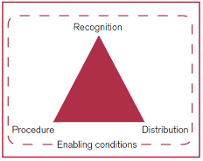

# CBD/COP/DEC/14/8

30 November 2018

## 14/8. Protected areas and other effective area-based conservation measures

_The Conference of the Parties,_

_Recognizing_ the relevance of international initiatives, experiences and activities, such as the Latin American Technical Cooperation Network on National Parks, other Protected Areas, and Wildlife (REDPARQUES) and the United Nations Educational, Scientific and Cultural Organization's Man and the Biosphere Programme and its World Network of Biosphere Reserves, for their contribution of protected areas and other effective area-based conservation measures,

_Welcoming_ the upcoming third Latin American and Caribbean Congress of Protected Areas (Lima, March 2019);

_Recognizing_ the work related to socio-ecological production landscapes under the Satoyama Initiative,

1. _Welcomes_ the voluntary guidance on integration of protected areas and other effective area-based conservation measures into the wider land- and seascapes and on mainstreaming these into sectors, as well as the voluntary guidance on governance and equity, contained in annexes I and II, respectively, to the present decision;

2. _Adopts_ the following definition of "other effective area-based conservation measures":

   "Other effective area-based conservation measure" means "a geographically defined area other than a Protected Area, which is governed and managed in ways that achieve positive and sustained long-term outcomes for the in situ conservation of biodiversity,[^1] with associated ecosystem functions and services and where applicable, cultural, spiritual, socio– economic, and other locally relevant values";

3. _Welcomes_ the scientific and technical advice on other effective area-based conservation measures, contained in annex III to the present decision, to be applied in a flexible way and on a case-by-case basis;

4. _Encourages_ Parties and _invites_ other Governments, relevant organizations, in collaboration with indigenous peoples and local communities, to apply the voluntary guidance contained in annexes I and II, on integration and mainstreaming, and governance and equity of protected areas and other effective area-based conservation measures, as appropriate, in accordance with national circumstances and legislation, and consistent and in harmony with the Convention and other international obligations;

5. _Encourages_ Parties and _invites_ other Governments, relevant organizations, in collaboration with indigenous peoples and local communities, to apply the scientific and technical advice on other effective area-based conservation measures contained in annex III, also taking into account, where appropriate, the 2016 report of the United Nations Special Rapporteur on the rights of indigenous peoples on the theme "indigenous peoples and conservation"[^2] and the 2017 report of the United Nations Special Rapporteur on human rights and the environment,[^3] including by:

   (a) Identifying other effective area-based conservation measures and their diverse options within their jurisdiction;

   (b) Submitting data on other effective area-based conservation measures to the United Nations Environment Programme's World Conservation Monitoring Centre for inclusion in the World Database on Protected Areas;

6. _Encourages_ Parties and _invites_ other Governments, relevant organizations and indigenous peoples and local communities to take into account the considerations in achieving Aichi Biodiversity Target 11 in marine and coastal areas, as contained in annex IV to the present decision, in their efforts to achieve all elements of Aichi Biodiversity Target 11 in marine and coastal areas;

7. _Also encourages_ Parties and _invites_ other Governments, relevant organizations, and indigenous peoples and local communities to share case studies/best practices and examples of management approaches, governance types and effectiveness related to other effective area-based conservation measures, including experiences with the application of the guidance, through the clearing-house mechanism of the Convention and other means;

8. _Invites_ the International Union for Conservation of Nature and the United Nations Environment Programme's World Conservation Monitoring Centre to expand the World Database on Protected Areas by providing a section on other effective area-based conservation measures;

9. _Invites_ the International Union for Conservation of Nature, the Food and Agriculture Organization of the United Nations, and other expert bodies to continue to assist Parties in identifying other effective area-based conservation measures and in applying the scientific and technical advice;

10. _Requests_ the Executive Secretary, subject to available resources, and in collaboration with partners, Parties, other Governments, relevant organizations and indigenous peoples and local communities, to provide capacity-building, including training workshops, to enable the application of the scientific and technical advice and guidance contained in the annexes to the present decision;

11. _Urges_ Parties, and _invites_ other Governments, relevant organizations and donors in a position to do so to provide resources for capacity-building and technology transfer, and to support Parties and indigenous peoples and local communities to identify other effective area-based conservation measures and to apply the scientific and technical advice and guidance;

12. _Urges_ Parties to facilitate mainstreaming of protected areas and other effective areabased conservation measures into key sectors, such as, _inter alia_, agriculture, fisheries, forestry, mining, energy, tourism and transportation, and in line with annex I.

## Annex I

### VOLUNTARY GUIDANCE ON THE INTEGRATION OF PROTECTED AREAS AND OTHER EFFECTIVE AREA-BASED CONSERVATION MEASURES INTO WIDER LAND- AND SEASCAPES AND MAINSTREAMING ACROSS SECTORS TO CONTRIBUTE, INTER ALIA, TO THE SUSTAINABLE DEVELOPMENT GOALS

#### I. CONTEXT

1. The integration of protected areas into wider landscapes, seascapes and sectors is made up of several components. Habitat fragmentation can have profound impacts on the functioning and integrity of complex ecological systems. The rate and extent of fragmentation, especially of forests, is immense. A 2015 study found that 70 per cent of the global forest cover is only within 1 kilometre of a forest edge (such as a road, or converted land use, such as agriculture), reducing biodiversity by as much as 75 per cent and imperilling ecosystem functioning.[^4] Intact habitat is increasingly recognized as essential for the functioning of larger ecological systems, as well as for ecosystem functions and services, including the cycling of water and carbon, and human health.[^5]

2. In the programme of work on protected areas, Goal 1.2 states that "By 2015, all protected areas and protected area systems are integrated into the wider land- and seascape, and relevant sectors, by applying the ecosystem approach and taking into account ecological connectivity and the concept, where appropriate, of ecological networks." In decision [X/6](https://www.cbd.int/decisions/cop/10/06), the Conference of the Parties, among other things, highlighted for Parties the importance of integrating biodiversity into poverty eradication and development, and in decision [XIII/3](https://www.cbd.int/decisions/cop/13/03), among other things, stressed the importance of mainstreaming and integrating biodiversity within and across sectors. In decision [X/31](https://www.cbd.int/decisions/cop/10/31), the Conference of the Parties, among other things, invited Parties to facilitate the integration of protected areas in national and economic development plans, where they exist.

3. Protected area integration can be defined as: "the process of ensuring that the design and management of protected areas, corridors and the surrounding matrix fosters a connected, functional ecological network."[^6] Protected area mainstreaming can be defined as the integration of the values, impacts and dependencies of the biodiversity and ecosystem functions and services provided by protected areas into key sectors, such as agriculture, fisheries, forestry, mining, energy, tourism, transportation, education and health.

4. Protected areas safeguard the biodiversity and ecosystems that underpin the Sustainable Development Goals.[^7] Protected areas are especially important in achieving goals related to poverty alleviation, water security, carbon sequestration, climate change adaptation, economic development and disaster risk reduction. Protected areas are an essential strategy for the emerging field of nature-based solutions to various global challenges, such as water security.[^8] They are particularly important as a nature‑based solution for climate mitigation[^9] and climate adaptation.[^10] Nature could provide at least a third of climate solutions if the planet is to stay under 1.5o C, and protected areas are an essential strategy for achieving this goal.

5. Despite this, the progress of protected area integration and mainstreaming remains slow, due to the lack of adequate human, financial and administrative resources, among other things, with very few countries identifying specific strategies within their national biodiversity strategies and action plans.[^11] Urgent action is required by Parties to make progress on both of these aims.

#### II. VOLUNTARY GUIDANCE

##### A. Suggested steps for enhancing and supporting integration into landscapes, seascapes and sectors

(a) _Review national visions, goals and targets_ to ensure that they include elements of integration of protected areas and other effective area-based conservation measures for increasing habitat connectivity and decreasing habitat fragmentation at the landscape and seascape scale;

(b) _Identify key species, ecosystems and ecological processes_ for which fragmentation is a key issue and which can benefit from improved connectivity, including those species, ecosystems and ecological processes that are vulnerable to the impacts of climate change and those species that may shift their range in response to climate change impact;

(c) _Identify and prioritize important areas to improve connectivity_ and to mitigate the impacts of fragmentation of landscapes and seascapes, including areas that create barriers and bottlenecks for annual and seasonal species movement, for various life stages, and for climate adaptation, and areas that are important for maintaining ecosystem functioning (e.g., riverine flood plains);

(d) _Conduct a national review_ of the status and trends of landscape and seascape habitat fragmentation and connectivity for key species, ecosystems and ecological processes, including a review of the role of protected areas and other effective area-based conservation measures, in maintaining landscape and seascape connectivity, and any key gaps;

(e) _Identify and prioritize the sectors_ most responsible for habitat fragmentation, including transportation, agriculture, fisheries, forestry, mining, tourism, energy, infrastructure and urban development, and develop strategies to engage them in developing strategies for mitigating the impacts on protected areas and protected area networks including other effective area-based conservation measures, and areas under active restoration programmes;

(f) _Review and adapt landscape and seascape plans and frameworks (both within and across sectors), including, for example, land-use and marine spatial plans, and sectoral plans_, such as subnational land-use plans, integrated watershed plans, integrated marine and coastal area management plans, transportation plans, and water-related plans, in order to improve connectivity and complementarity and reduce fragmentation and impacts;

(g) _Prioritize and implement measures_ to decrease habitat fragmentation within landscapes and seascapes and to increase connectivity, including the creation of new protected areas and the identification of other effective area-based conservation measures, as well as indigenous and community conserved areas, that can serve as stepping stones between habitats, the creation of conservation corridors to connect key habitats, the creation of buffer zones to mitigate the impacts of various sectors, to enhance the protected and conserved areas estate, and the promotion of sectoral practices that reduce and mitigate their impacts on biodiversity, such as organic agriculture and long-rotation forestry.

##### B. Suggested steps for enhancing and supporting the mainstreaming of protected areas and other effective area-based conservation measures across sectors

(a) _Identify, map and prioritize areas important for essential ecosystem functions and services_, including ecosystems that are important for food (e.g., mangroves for fisheries), for climate mitigation (e.g., carbon-dense ecosystems, such as forests, peatlands, mangroves), for water security (e.g., mountains, forests, wetlands and grasses that provide both surface and groundwater), for poverty alleviation (e.g., ecosystems that provide subsistence, livelihoods and employment), and for disaster risk reduction (e.g., ecosystems that buffer impacts from coastal storms, such as reefs, seagrass beds, floodplains);

(b) _Review and update sectoral plans_ to ensure that the many values provided by protected areas and other effective area-based conservation measures, are recognized and incorporated into sectoral plans;

(c) _Develop targeted communications campaigns_ aimed at the various sectors, both government and private, that depend upon the biodiversity and ecosystem functions and services provided by protected areas and other effective area-based conservation measures, including agriculture, fisheries, forestry, water, tourism, national and subnational security, development, and climate change, with the objective of increasing awareness of the value of nature for their sectors;

(d) _Review and revise existing policy and finance frameworks_ to identify opportunities to improve the enabling policy and finance environment for sectoral mainstreaming;

(e) _Encourage innovative finance_, including investors, insurance companies and others, to identify and finance new and existing protected areas, and other effective area-based measures and restoration of key degraded protected areas to deliver on essential ecosystem functions and services and promote financial models that promote the sustainability of longterm protected area systems;

(f) _Assess and update the capacities required_ to improve the mainstreaming of protected areas and other effective area-based conservation measures, including capacities related to creating enabling policy environments, to spatial mapping of essential ecosystem functions and services, and to assessing the multiple values of ecosystem functions and services.

## Annex II

### VOLUNTARY GUIDANCE ON EFFECTIVE GOVERNANCE MODELS FOR MANAGEMENT OF PROTECTED AREAS, INCLUDING EQUITY, TAKING INTO ACCOUNT WORK BEING UNDERTAKEN UNDER ARTICLE 8(J) AND RELATED PROVISIONS

#### I. CONTEXT

1. Governance is a key factor for protected areas to succeed in conserving biodiversity and supporting sustainable livelihoods. Enhancing protected area governance in terms of diversity, quality, effectiveness and equity can facilitate the achievement of Aichi Biodiversity Target 11 and help face ongoing local and global challenges.[^12] The achievement of the coverage, representativeness, connectivity and qualitative elements of Target 11 can be facilitated by recognizing the role and contributions of a diversity of actors and approaches for area-based conservation. Such diversity broadens ownership, potentially promoting collaboration and reducing conflict as well as facilitating resilience in the face of change.

2. Governance arrangements for protected and conserved areas that are tailored to their specific context, socially inclusive, respectful of rights, and effective in delivering conservation and livelihood outcomes tend to increase the legitimacy of protected and conserved areas for indigenous peoples and local communities, and society at large.

3. In decision [X/31](https://www.cbd.int/decisions/cop/10/31), the Conference of the Parties, among other things, identified Element 2 on governance, participation, equity and benefit-sharing of the programme of work on protected areas as a priority issue in need of greater attention.[^13] Since then, Parties have gained experience, and methodologies and tools have been developed to assess governance and design action plans. These have led to an increased understanding of essential concepts, particularly equity.[^14]

##### A. Voluntary guidance on governance diversity

4. The Convention on Biological Diversity and the International Union for Conservation of Nature (IUCN) distinguish four broad governance types for protected and conserved areas according to which actors have authority and a responsibility to make and enforce decisions: (a) governance by government; (b) shared governance (by various actors together[^15]); (c) governance by private individuals or organizations (often land owners and in the form of private protected areas (PPAs)); and (d) governance by indigenous peoples and/or local communities (often referred to as territories and areas conserved by indigenous peoples and local communities (ICCAs) or Indigenous Protected Areas (IPAs)).

5. Diversity of governance pertains primarily to the existence of a range of different governance types and sub-types, in terms of both legal provisions and practices, and their complementarity in achieving _in situ_ conservation. The concept of governance type is also relevant for the question whether a given type is appropriate to a specific context.[^16]

6. In line with decisions [VII/28](https://www.cbd.int/decisions/cop/07/28) and [X/31](https://www.cbd.int/decisions/cop/10/31), this voluntary guidance suggests steps that can be followed in relation to the recognition, support, verification and coordination, tracking, monitoring and reporting of areas voluntarily conserved by indigenous peoples and local communities, private landowners and other actors. Particularly in the case of territories and areas under the governance of indigenous peoples and local communities, such steps should be taken with their free, prior and informed consent, consistent with national policies, regulations and circumstances, and applicable international obligations, and based on respect for their rights, knowledge and institutions. In addition, in the case of areas conserved by private landowners, such steps should be taken with their approval and on the basis of respect for the owners' rights and knowledge.[^17]

7. Suggested steps for enhancing and supporting governance diversity in national or subnational systems of protected and conserved areas include:

   (a) _Develop a high-level policy or vision statement in consultation with stakeholders_ that acknowledges a diversity of conservation actors and their contributions to national or subnational systems of protected and conserved areas. Such a statement would help to create the framework for subsequent legislative adaptations. It may also provide encouragement for _in situ_ conservation initiatives of actors;[^18]

   (b) _Facilitate the coordinated management of multiple sites_ of different governance types to achieve conservation objectives at larger landscape and seascape scales by appropriate means;

   (c) _Clarify and determine the institutional mandates, roles and responsibilities_ of all relevant State and non-State actors recognized in the national or subnational protected and conserved areas system, in coordination with other (subnational, sectoral) jurisdictions where applicable;

   (d) _Conduct a system-level governance assessment as a collaborative multi-stakeholder process_. In large part, such an assessment serves as a gap analysis between an existing national or subnational protected area network and the potentially achievable area-based conservation, if areas presently protected or conserved _de facto_ by various actors and approaches were recognized, encouraged and supported to take or share responsibility;[^19] [^20]

   (e) _Facilitate the coordinated monitoring and reporting_, on protected and conserved areas under different governance types by appropriate means and in accordance with national legislation, including to the World Database on Protected Areas, and taking appropriate account of their contributions to the elements of Target 11;

   (f) _Review and adapt the policy, legal and regulatory framework for protected and conserved areas_ on the basis of the opportunities identified in the assessment and in line with decision [X/31](https://www.cbd.int/decisions/cop/10/31) to incentivize and legally recognize different governance types;[^21]

   (g) _Support and secure the protection status_ of the protected and conserved areas under all governance types through appropriate means and strengthen the management of those types of governance;

   (h) _Support national associations or alliances_ of protected and conserved areas according to governance types (e.g., ICCA alliance, PPA association) to provide peer support mechanisms;

   (i) _Verify the contribution of such areas_ to the overall achievement of the country's system of protected areas in terms of coverage and conservation status by mapping and other appropriate means.

##### B. Voluntary guidance on effective and equitable governance models

8. Effective and equitable governance models for protected and conserved areas are arrangements for decision-making and implementation of decisions in which "good governance" principles are adopted and applied. Good governance principles should be applied irrespective of governance type. Based on the good governance principles developed by United Nations agencies and other organizations, IUCN has suggested governance principles and considerations for the context of protected and conserved areas as guidance for decisions to be taken and implemented legitimately, competently, inclusively, fairly, with a sense of vision, accountably and while respecting rights.[^22]

9. The concept of equity is one element of good governance. Equity can be broken down into three dimensions: recognition, procedure and distribution: "Recognition" is the acknowledgement of and respect for the rights and the diversity of identities, values, knowledge systems and institutions of rights holders[^23] and stakeholders; "Procedure" refers to inclusiveness of rule‑ and decision-making; "Distribution" implies that costs and benefits resulting from the management of protected areas must be equitably shared among different actors. The figure below shows the three dimensions. A recently developed framework for advancing equity in the context of protected areas[^24] [^25], proposes a set of principles against which the three dimensions can be assessed.

**Figure. The three dimensions of equity embedded within a set of enabling conditions**

_Source_: Adapted from McDermott et al. (2013). _Examining equity: A multidimensional framework for assessing equity in payments for ecosystem service. Environmental Science and Policy_ 33: 416-427, and Pascual et al. (2014). _Social equity matters in payments for ecosystem services. Bioscience_ 64(11) 1027-1036.

10. Good governance implies that potential negative impacts, particularly on the human well-being of vulnerable and natural resource-dependent peoples, are assessed, monitored and avoided or mitigated, and positive impacts enhanced. The governance type and the arrangements for decision-making and implementation need to be tailored to the specific context in such a way as to ensure that rights holders and stakeholders that are impacted by the protected area can participate effectively.

11. Elements of effective and equitable governance models for protected and conserved areas may include:
    (a) Appropriate procedures and mechanisms for the full and effective participation of indigenous peoples and local communities,[^26] ensuring gender equality in full respect of their rights and recognition of their responsibilities, in accordance with national legislation and in harmonization with their regulatory systems and ensuring legitimate representation, including in the establishment, governance, planning, monitoring and reporting of protected and conserved areas on their traditional territories (lands and waters);[^27]

    (b) Appropriate procedures and mechanisms for the effective participation of and/or coordination with other stakeholders;

    (c) Appropriate procedures and mechanisms to recognize and accommodate customary tenure and governance systems in protected areas,[^28] including customary practices and customary sustainable use, in line with the Plan of Action on Customary Sustainable Use; [^29]

    (d) Appropriate mechanisms for transparency and accountability, taking into consideration internationally agreed standards and best practices;[^30]

    (e) Appropriate procedures and mechanisms for fair dispute or conflict resolution;

    (f) Provisions for equitable sharing of benefits and costs, including through:

    - (i) Assessing the economic and sociocultural costs and benefits associated with the establishment and management of protected areas;

    - (ii) Reducing, avoiding or compensating for costs;

    - (iii) Equitably sharing benefits[^31] based on criteria agreed among rights holders and stakeholders;[^32]

    (g) Safeguards that ensure the impartial and effective implementation of the rule of law;

    (h) A monitoring system that covers governance issues, including impacts on the well‑being of indigenous peoples and local communities;

    (i) Consistency with Articles 8(j) and 10(c) and related provisions, principles and guidelines, including free, prior and informed consent, consistent with national policies, regulations and circumstances, through respecting, preserving, and maintaining the traditional knowledge of indigenous peoples and local communities,[^33] and with due respect for customary sustainable use of biodiversity.

12. Suggested actions that could be taken by Parties to enable and support effective and equitable governance models tailored to their context for protected areas under their mandate include:

    (a) Conduct, in consultation with relevant rights holders and stakeholders, a review of protected area policy and legislation against good governance principles, including equity, and taking into consideration relevant internationally agreed standards and guidance.[^34] Such a review can be conducted as part of a system-level governance assessment;

    (b) Facilitate and engage in site-level governance assessments in participatory multi‑stakeholder processes, take actions for improvement at the site level and draw lessons for the policy level;[^35]

    (c) Adapt protected area policy and legislation for their establishment, governance, planning, management and reporting as appropriate on the basis of the review and its results and taking into consideration elements indicated under paragraph 11 above;

    (d) Facilitate assessment and monitoring of economic and sociocultural costs and benefits associated with the establishment and management of protected areas, and avoid, mitigate or compensate for costs while enhancing and equitably distributing benefits;[^36]

    (e) Establish or strengthen national policies for access to genetic resources within protected areas and the fair and equitable sharing of benefits arising from their utilization;[^37]

    (f) Facilitate and engage in capacity-building initiatives on governance and equity for protected and conserved areas;

    (g) Facilitate appropriate funding to secure effective participation of all rights holders and stakeholders;

13. Suggested actions that could be taken by other actors governing protected areas to enhance the effectiveness and equity of governance include:

    (a) Conduct site-level governance and equity assessments in ways that are inclusive of rights holders and stakeholders, and take action aimed at improvement;

    (b) Assess, monitor and mitigate any negative impacts arising from the establishment and/ or maintenance of a protected or conserved area and enhance positive ones;[^38]

    (c) Engage in capacity-building initiatives on governance and equity for protected and conserved areas.

## Annex III

### SCIENTIFIC AND TECHNICAL ADVICE ON OTHER EFFECTIVE AREA-BASED CONSERVATION MEASURES

The guiding principles and common characteristics and criteria for identification of other effective area-based conservation measures are applicable across all ecosystems currently or potentially important for biodiversity, and should be applied in a flexible way and on a case-by-case basis.

#### A. GUIDING PRINCIPLES AND COMMON CHARACTERISTICS

(a) Other effective area-based conservation measures have a significant biodiversity value, or have objectives to achieve this, which is the basis for their consideration to achieve Target 11 of Strategic Goal C of the Strategic Plan for Biodiversity 2011-2020;

(b) Other effective area-based conservation measures have an important role in the conservation of biodiversity and ecosystem functions and services, complementary to protected areas and contributing to the coherence and connectivity of protected area networks, as well as in mainstreaming biodiversity into other uses in land and sea, and across sectors. Other effective area-based conservation measures should, therefore, strengthen the existing protected area networks, as appropriate;

(c) Other effective area-based conservation measures reflect an opportunity to provide _in situ_ conservation of biodiversity over the long-term in marine, terrestrial and freshwater ecosystems. They may allow for sustainable human activities while offering a clear benefit to biodiversity conservation. By recognizing an area, there is an incentive for sustaining existing biodiversity values and improving biodiversity conservation outcomes;

(d) Other effective area-based conservation measures deliver biodiversity outcomes of comparable importance to and complementary with those of protected areas; this includes their contribution to representativeness, the coverage of areas important for biodiversity and associated ecosystem functions and services, connectivity and integration in wider landscapes and seascapes, as well as management effectiveness and equity requirements;

(e) Other effective area-based conservation measures, with relevant scientific and technical information and knowledge, have the potential to demonstrate positive biodiversity outcomes by successfully conserving _in situ_ species, habitat and ecosystems and associated ecosystem functions and services and by preventing, reducing or eliminating existing, or potential threats, and increasing resilience. Management of other effective area-based conservation measures is consistent with the ecosystem approach and the precautionary approach, providing the ability to adapt to achieve biodiversity outcomes, including longterm outcomes, inter alia, the ability to manage a new threat;

(f) Other effective area-based conservation measures can help deliver greater representativeness and connectivity in protected area systems and thus may help address larger and pervasive threats to the components of biodiversity and ecosystem functions and services, and enhance resilience, including with regard to climate change;

(g) Recognition of other effective area-based conservation measures should follow appropriate consultation with relevant governance authorities, land owners and rights owners, stakeholders and the public;

(h) Recognition of other effective area-based conservation measures should be supported by measures to enhance the governance capacity of their legitimate authorities and secure their positive and sustained outcomes for biodiversity, including, inter alia, policy frameworks and regulations to prevent and respond to threats;

(i) Recognition of other effective area-based conservation measures in areas within the territories of indigenous peoples and local communities should be on the basis of selfidentification and with their free, prior and informed consent, as appropriate, and consistent with national policies, regulations and circumstances, and applicable international obligations;

(j) Areas conserved for cultural and spiritual values, and governance and management that respect and are informed by cultural and spiritual values, often result in positive biodiversity outcomes;

(k) Other effective area-based conservation measures recognize, promote and make visible the roles of different governance systems and actors in biodiversity conservation; Incentives to ensure effectiveness can include a range of social and ecological benefits, including empowerment of indigenous peoples and local communities;

(l) The best available scientific information, and indigenous and local knowledge, should be used in line with international obligations and frameworks, such as the United Nations Declaration on the Rights of Indigenous Peoples, and instruments, decisions and guidelines of the Convention on Biological Diversity, for recognizing other effective area-based conservation measures, delimiting their location and size, informing management approaches and measuring performance;

(m) It is important that other effective area-based conservation measures be documented in a transparent manner to provide for a relevant evaluation of the effectiveness, functionality and relevance in the context of Target 11.

#### B. CRITERIA FOR IDENTIFICATION

<table width=100% cellspacing=0 cellpadding=0>
 <tr>
  <td colspan=2><b>Criterion A: Area is not currently recognized as a protected area</b></td>
 </tr>
 <tr>
  <td>
  <b>Not a protected area</b></td>
  <td>
    <ul>
      <li>The area is not currently recognized or reported as a protected area or part of protected area; it may have been established for another function.</li>
    </ul>
  </td>
 </tr>
 <tr>
  <td colspan=2><b>Criterion B: Area is governed and managed</b></td>
 </tr>
 <tr>
  <td><b>Geographically defined space</b></td>
  <td>
    <ul>
      <li>Size and area are described, including in three dimensions where necessary.</li>
      <li>Boundaries are geographically delineated.</li>
    </ul>
  </td>
 </tr>
 <tr>
  <td><b>Legitimate governance authorities</b></td>
  <td>
    <ul>
      <li>Governance has legitimate authority and is appropriate for achieving in&nbsp;situ conservation of biodiversity within the area;</li>
      <li>Governance by indigenous peoples and local communities is self-identified in accordance with national legislation and applicable international obligations;</li>
      <li>Governance reflects the equity considerations adopted in the Convention.</li>
      <li>Governance may be by a single authority and/or organization or through collaboration among relevant authorities and provides the ability to address threats collectively.</li>
    </ul>
  </td>
 </tr>
 <tr>
  <td><b>Managed</b></td>
  <td>
    <ul>
      <li>Managed in ways that achieve positive and sustained outcomes for the conservation of biological diversity.</li>
      <li>Relevant authorities and stakeholders are identified and involved in management.</li>
      <li>A management system is in place that contributes to sustaining the <i>in situ</i> conservation of biodiversity.</li>
      <li>Management is consistent with the ecosystem approach with the ability to adapt to achieve expected biodiversity conservation outcomes, including long-term outcomes, and including the ability to manage a new threat.</li>
    </ul>
  </td>
 </tr>
 <tr>
  <td colspan=2><b>Criterion C: Achieves sustained and effective contribution to <i>in situ</i> conservation of biodiversity</b></td>
 </tr>
 <tr>
  <td>
  <b>Effective</b></td>
  <td>
    <ul>
      <li>The area achieves, or is expected to achieve, positive and sustained outcomes for the <i>in situ</i> conservation of biodiversity.</li>
      <li>Threats, existing or reasonably anticipated ones are addressed effectively by preventing, significantly reducing or eliminating them, and by restoring degraded ecosystems.</li>
      <li>Mechanisms, such as policy frameworks and regulations, are in place to recognize and respond to new threats.</li>
      <li>To the extent relevant and possible, management inside and outside the other effective area-based conservation measure is integrated.</li>
    </ul>
  </td>
 </tr>
 <tr>
  <td>
  <b>Sustained over long term</b></td>
  <td>
    <ul>
      <li>The other effective area-based conservation measures are in place for the long term or are likely to be.</li>
      <li>“Sustained” pertains to the continuity of governance and management and “long term” pertains to the biodiversity outcome.</li>
    </ul>
  </td>
 </tr>
 <tr>
  <td><b>In situ conservation of biological diversity</b></td>
  <td>
    <ul>
      <li>Recognition of other effective area-based conservation measures is expected to include the identification of the range of biodiversity attributes for which the site is considered important (e.g. communities of rare, threatened or endangered species, representative natural ecosystems, range restricted species, key biodiversity areas, areas providing critical ecosystem functions and services, areas for ecological connectivity).</li>
    </ul>
  </td>
 </tr>
 <tr>
  <td><b>Information and monitoring</b></td>
  <td>
    <ul>
      <li>Identification of other effective area-based conservation measures should, to the extent possible, document the known biodiversity attributes, as well as, where relevant, cultural and/or spiritual values, of the area and the governance and management in place as a baseline for assessing effectiveness.</li>
      <li>A monitoring system informs management on the effectiveness of measures with respect to biodiversity, including the health of ecosystems.</li>
      <li>Processes should be in place to evaluate the effectiveness of governance and management, including with respect to equity.</li>
      <li>General data of the area such as boundaries, aim and governance are available information.</li>
    </ul>
  </td>
 </tr>
 <tr>
  <td colspan=2>
  <b>Criterion D: Associated ecosystem functions and services and cultural, spiritual, socio-economic and other locally relevant values</b></td>
 </tr>
 <tr>
  <td><b>Ecosystem functions and services</b></td>
  <td>
    <ul>
      <li>Ecosystem functions and services are supported, including those of importance to indigenous peoples and local communities, for other effective area-based conservation measures concerning their territories, taking into account interactions and trade-offs among ecosystem functions and services, with a view to ensuring positive biodiversity outcomes and equity.</li>
      <li>Management to enhance one particular ecosystem function or service does not impact negatively on the sites overall biological diversity.</li>
    </ul>
  </td>
 </tr>
 <tr>
  <td><b>Cultural, spiritual, socio-economic and other locally relevant values</b></td>
  <td>
    <ul>
      <li>Governance and management measures identify, respect and uphold the cultural, spiritual, socioeconomic, and other locally relevant values of the area, where such values exist.</li>
      <li>Governance and management measures respect and uphold the knowledge, practices and institutions that are fundamental for the <i>in situ</i> conservation of biodiversity.</li>
    </ul>
  </td>
 </tr>
</table>

#### C. FURTHER CONSIDERATIONS

1. Management approaches

   (a) Other effective area-based conservation measures are diverse in terms of purpose, design, governance, stakeholders and management, especially as they may consider associated cultural, spiritual, socio-economic, and other locally relevant values. Accordingly, management approaches for other effective area-based conservation measures are and will be diverse;

   (b) In accordance with national legislation and circumstances, and consistent with national policy and regulation, management approaches should consider:

   - (i) Any destabilization of the relationship between indigenous peoples and local communities and wildlife that reside in the protected areas;

   - (ii) The existing governance and equity systems of indigenous peoples and local communities with respect to transboundary protected areas and conservation corridors;

   - (iii) Any conflict of overlap between other effective area-based conservation measures and already existing territories and areas conserved by indigenous peoples and local communities, including their governance systems, with due account being taken of free, prior and informed consent;

   (c) Some other effective area-based conservation measures may be established, recognized or managed to intentionally sustain _in situ_ conservation of biodiversity. This purpose is either the primary management objective, or part of a set of intended management objectives;

   (d) Other effective area-based conservation measures may be established, recognized or managed primarily for purposes other than _in situ_ conservation of biodiversity. Thus their contribution to _in situ_ conservation of biodiversity is a co-benefit to their primary intended management objective or purpose. It is desirable that this contribution become a recognized objective of the management of the other effective area-based conservation measures;

   (e) In all cases where _in situ_ conservation of biodiversity is recognized as a management objective, specific management measures should be defined and enabled;

   (f) Monitoring the effectiveness of other effective area-based conservation measures is needed. This could include: (i) baseline data, such as documentation of the biodiversity values and elements; (ii) ongoing community-based monitoring, and incorporation of traditional knowledge, where appropriate; (iii) monitoring over the long-term, including how to sustain biodiversity and improve _in situ_ conservation; and (iv) monitoring of governance, stakeholder involvement and management systems that contribute to the biodiversity outcomes.

2. Role in achieving Aichi Biodiversity Target 11

   (a) By definition, other effective area-based conservation measures that fulfil the criteria in Section B, contribute to both quantitative (i.e. the 17% and 10% coverage elements) and qualitative elements (i.e. representativity, coverage of areas important for biodiversity, connectivity and integration in wider landscapes and seascapes, management effectiveness and equity) of Aichi Biodiversity Target 11;

   (b) Since other effective area-based conservation measures are diverse in terms of purpose, design, governance, stakeholders and management, they will often also contribute to other Aichi Biodiversity Targets, targets of the 2030 Agenda for Sustainable Development, and the objectives or targets of other multilateral environmental agreements.[\[39\]](#page-22-11)

## Annex IV

### CONSIDERATIONS IN ACHIEVING AICHI BIODIVERSITY TARGET 11 IN MARINE AND COASTAL AREAS

These considerations are based upon discussions at the Expert Workshop on Marine Protected Areas and Other Effective Area-based Conservation Measures for achieving Aichi Biodiversity Target 11 in Marine and Coastal Areas as well as background materials prepared for the workshop (see CBD/MCB/EM/2018/1/3).

#### A. Unique aspects of the marine environment with relevance to area-based conservation/management measures

1. While there are similar tools and approaches for area-based conservation/management in marine and terrestrial areas, there exist a number of inherent differences between the marine and terrestrial environments that affect the application of area-based conservation measures. These unique aspects include the following:

   (a) The three-dimensional nature of the marine environment (with maximum depth of almost 11 km in the deep ocean), which is heavily influenced by changes in physicochemical properties, including pressure, salinity and light;

   (b) The dynamic nature of the marine environment, which is influenced by, for example, currents and tides, and facilitates connectivity among ecosystems and habitats;

   (c) Nature of habitat fragmentation and connectivity in the marine environment;

   (d) Lack of visibility and/or remoteness of the features being conserved;

   (e) Primary production in the marine environment is often limited to the coastal zone for habitat forming species with phytoplankton distributed through the pelagic photic zone, while the standing stock in terrestrial environments is widespread and structural. There is also a higher turnover in the primary production of the marine environment, which varies with annual cycles, tied to temperature and currents;

   (f) In terrestrial environments, the atmosphere is well mixed at a much broader scale, whereas mixing in marine environments can change within significantly smaller scales;

   (g) Climate change impacts will affect marine and terrestrial areas very differently, as coastal areas are subject to erosion and storm surge, and protection efforts can be lost as a result of one large weather event. The pervasive impact of ocean acidification can impact the entire standing stock of primary productivity in a marine area, having knock-on effects throughout the food web;

   (h) Differences in resilience and recovery rates of biodiversity and ecosystems;

   (i) Differences in approaches and challenges in monitoring and data collection;

   (j) Potentially different legal regimes for different portions of the same marine areas (e.g., seabed and water column in marine areas beyond national jurisdiction);

   (k) Frequent lack of clear ownership of specific areas in the marine environment, with multiple users and stakeholders, often with overlapping and sometimes competing interests;

   (l) Frequent occurrence of multiple regulatory authorities with competence in a given area;

   (m) Expectation of resource-based "outcomes": from an economic perspective, area-based conservation measures in the marine environment are expected, in many cases, to improve fishery resources and restore productivity. In terrestrial environments, the focus is largely on protecting animals without the expectation that they can be harvested once populations increase.

#### B. Main types of area-based conservation measures in marine and coastal areas

2. There exist a number of different types of area-based conservation/management measures that are applied in marine and coastal areas. Such measures can be categorized in different ways and are not necessarily mutually exclusive. These area-based conservation/ management measures can be generally categorized as:

   (a) _Marine and coastal protected areas_: Article 2 of the Convention defines a "protected area" as a geographically defined area which is designated or regulated and managed to achieve specific conservation objectives;

   (b) _Territories and areas governed and managed by indigenous peoples and local communities_: in these types of approaches, some or all of the governance and/or management authority is often ceded to the indigenous peoples and local communities, and conservation objectives are often tied to food security, and access to resources for indigenous peoples and local communities;

   (c) _Area-based fisheries management measures_: these are formally established, spatially defined fishery management and/or conservation measures, implemented to achieve one or more intended fishery outcomes. The outcomes of these measures are commonly related to sustainable use of the fishery. However, they can also often include protection of, or reduction of impact on, biodiversity, habitats, or ecosystem structure and function;

   (d) _Other sectoral area-based management approaches_: there are a range of area-based measures applied in other sectors at different scales and for different purposes. These include, for example, Particularly Sensitive Sea Areas (areas designated by the International Maritime Organization for protection from damage by international maritime activities because of ecological, socioeconomic or scientific significance), Areas of Particular Environmental Interest (areas of the seafloor designated by the International Seabed Authority for protection from damage by deep-seabed mining because of biodiversity and ecosystem structure and function), approaches within national work on marine spatial planning, as well as conservation measures in other sectors.

#### C. Approaches for accelerating progress towards Aichi Biodiversity Target 11 in marine and coastal areas

3. The following approaches could accelerate national progress in achieving Aichi Biodiversity Target 11 in marine and coastal areas, recognizing that these are not exhaustive and that there are other sources of guidance on these issues:
   _1. Providing an adequate base of information_

   (a) Identify the information that is needed to address qualitative elements, including information on biodiversity, ecosystems and biogeography as well as information on current threats to biodiversity and potential threats from new and emerging pressures;

   (b) Synthesize and harmonize various types of information, with free, prior and informed consent, when this applies to the knowledge of indigenous peoples as appropriate and consistent with national policies, regulations and circumstances, and applicable international obligations, including information on ecologically or biologically significant marine areas (EBSAs), Key Biodiversity Areas (KBAs), vulnerable marine ecosystems (VMEs), Particularly Sensitive Sea Areas (PSSAs), Important Marine Mammal Areas (IMMAs);

   (c) Develop and/or improve mechanism(s) for standardizing, exchanging and integrating information (e.g., clearing-house mechanisms, the Global Ocean Observing System and other monitoring systems).

   _2. Engagement of rights-holders and stakeholders_

   (a) Identify relevant rights-holders and stakeholders, considering livelihoods, cultural and spiritual specificities at various scales;

   (b) Develop and foster communities of practice and rights-holder and stakeholder networks that will facilitate mutual learning and exchange and also support governance, monitoring, enforcement, reporting and assessment;

   (c) Build a common understanding across rights-holders and stakeholders of the objectives and expected outcomes;

   (d) Foster and support strong social and communication skills in managers and practitioners of marine protected areas and other effective area-based conservation measures.

   _3. Governance, monitoring and enforcement_

   (a) Identify the policies and management measures in place, including those outside of the protected/conserved areas;

   (b) Make better use of new developments in open source data (e.g., satellite information) in accordance with national legislation;

   (c) Build and/or strengthen global monitoring mechanisms and partnerships to reduce the overall costs of monitoring;

   (d) Engage indigenous peoples and local communities, as well as respected local leaders, in monitoring and enforcement, and enhance the capacity of local communities to conduct monitoring, in accordance with national legislation;

   (e) Enhance the capacity of scientists to use indigenous and local knowledge, respecting the appropriate cultural contexts;

   (f) Build the capacities of managers and practitioners;

   (g) Facilitate collaboration, communication and exchange of best practices among managers and practitioners;

   (h) Identify gaps and barriers to effective governance and compliance;

   (i) Make use of existing standards and indicators, and improve the visibility and uptake of various global and regional standards to facilitate common approaches across different scales;

   (j) Recognize and support the role of indigenous peoples and local communities in governance, monitoring and enforcement, in accordance with national legislation.

   _4. Assessing and reporting progress in achieving the qualitative aspects of Aichi Biodiversity Target 11_

##### Assessment

(a) Ensure the appropriate conditions are in place to facilitate assessment and analysis (e.g., legal basis, policies, conservation objectives and expertise);

(b) Develop a common understanding of what effectiveness means across stakeholder groups, in line with the objectives of the protected/conserved areas;

(c) Develop clear, reliable and measurable indicators for assessing the effectiveness of the protected/conserved areas in achieving their objectives;

(d) Develop standardized approaches for assessment across mechanisms/processes;

(e) Assess protected/conserved areas at the network scale and at the level of individual areas;

(f) Develop and foster communities of practice to support assessment;

##### Reporting

(a) Improve the frequency and accuracy of reporting, including by maximizing the use of existing reporting mechanisms;

(b) Enhance the visibility of reporting to encourage analysis by a range of experts across disciplines;

(c) Ensure that management is effectively informed by reporting and analysis through appropriate feedback mechanisms in order to facilitate adaptive management;

(d) Build the capacity of developing countries to undertake reporting and management effectiveness analyses;

(e) Build the political will to support timely and effective reporting, including through specific government commitments for regular and adequate reporting;

(f) Engage indigenous peoples and local communities in reporting and assessment;

(g) Develop standardized approaches to reporting across mechanisms/processes;

(h) Develop and foster communities of practice to support reporting.

4. The following approaches could accelerate national progress in achieving Aichi Target 11 in marine and coastal areas, in particular with regard to ensuring the effective integration of marine protected areas and other effective area-based conservation measures into wider landscapes and seascapes, recognizing that these are not exhaustive and that there are other sources of guidance on these issues:

   (a) Identify how marine protected areas and other effective area-based conservation measures fit into and enhance landscape and seascape planning frameworks, including marine spatial planning, integrated coastal management, and systematic conservation planning;

   (b) Assess what information is needed and identify the best scale(s) for collecting information, including on: existing legal and policy frameworks; ecological and biological features, and areas of specific conservation interest; uses and activities in the wider landscape and seascape and in specific areas of conservation interest, relevant stakeholders active in or with interest in the wider landscape and seascape, and potential interactions among human uses; cumulative impacts across a range of spatial scales, and responses and resilience/vulnerability of systems to increasing human use and natural forces; and connectivity within and outside the landscape and seascape;

   (c) Identify available sources of data and information (including traditional and local knowledge), identify information gaps and compile available data, models and other relevant information, and develop and/or improve user-friendly, open-source, efficient and transparent tools for data visualization and integration;

   (d) Recognize and understand diverse value systems;

   (e) Ensure the full and effective engagement of indigenous peoples and local communities;

   (f) Develop a common understanding among stakeholders regarding the objectives of integrating marine protected areas and other effective area-based conservation measures into the wider landscape and seascape;

   (g) Ensure that all activities are accountable for their impacts, both within and outside marine protected areas and other effective area-based conservation measures;

   (h) Develop clear, reliable, and measurable indicators for assessing the effectiveness of the marine protected areas and other effective area-based conservation measures in achieving their objectives, and for assessing the status of the wider landscape and seascape;

5. The following are approaches for managing the wider landscape and seascape in order to ensure that marine protected areas and other effective area-based conservation measures are effective, recognizing that these are not exhaustive and that there are other sources of guidance on these issues:

   (a) Develop and/or enhance integrated governance and management to support landscape and seascape planning, and coordinate planning, objective-setting, and governance across geographic scales;

   (b) Develop and/or refine decision-support tools for landscape and seascape planning;

   (c) Ensure that relevant legislation is in place and enforced;

   (d) Understand and assess the status of use and management of the wider landscape and seascape and identify areas in need of enhanced protection;

   (e) Conduct threat assessments, and use a mitigation hierarchy;

   (f) Evaluate the relative compatibility and/or incompatibility of existing and proposed uses, as well as the interactions and impacts of broader environmental change (e.g., climate change);

   (g) Understand conflicts and displacement of livelihoods and identify relevant approaches to provide alternative livelihoods and compensation;

   (h) Communicate with and involve relevant stakeholders across the wider landscape and seascape in an accessible, effective and appropriate manner;

   (i) Ensure that planning and management is in line with the range of cultures and value systems in the wider landscape and seascape;

   (j) Identify and engage local/national leaders and champions;

   (k) Build and/or enhance capacity to support wider landscape and seascape planning.

#### D. Lessons from experiences in the use of various types of area-based conservation/management measures in marine and coastal areas

6. The following lessons from experiences in various types of area-based conservation/ management measures in marine and coastal areas were highlighted:

   (a) For various types of area-based conservation/management measures (with differences in area, duration and degree of restriction), performance in terms of protecting biodiversity can be highly variable and is often due to the ecological, socioeconomic, and governance context of the area, and the nature of implementation of the measure;

   (b) Although increases in the area, duration and degree of restriction will generally increase the protection of many biodiversity components, the ecosystem impacts of the human activities displaced by the exclusions may also increase in the areas where those activities continue. Effective overall conservation planning needs to include all these considerations;

   (c) Well-designed and implemented measures can be effective even if the areas are not large and with permanent restrictions, and poorly designed or implemented measures can be ineffective, regardless of their scale;

   (d) Evaluation of the effectiveness of area-based conservation measures should be done on a case-by-case basis, taking into account the characteristics of the measure(s) being implemented and the context in which it is implemented, with shared responsibility;

   (e) The key features of the area to consider in the evaluation of specific applications of an area-based conservation/management measure include:

   - (i) The ecological components of special conservation concern in both the specific area and the larger region, in relation to adjacent ecosystems and how the measure could contribute to their conservation;

   - (ii) The size, duration, extent of restrictions and placement of the area;

   - (iii) The ability of the management authority to implement the measure if adopted, and monitor and provide enforcement in the area while the measure is in place;

   - (iv) The potential contributions the measure could make to benefit local populations and sustainable use, in addition to conservation;
     (f) Important attributes of the context in which the measure would be applied that also should be taken into account in the case-by-case evaluations include:

   - (i) The extent to which the measure was developed within the ecosystem approach, and is well integrated with the other measures being used;

   - (ii) The extent to which the measure was developed using the best scientific information and indigenous and local knowledge available, and an appropriate application of precaution;

   - (iii) The degree of protection that the measure offers to the biodiversity components of high priority, taking into account other actual or potential threats in the same area, and, when relevant, outside the area;

   - (iv) The governance processes leading to development and adoption of the measure, and their implications for compliance and cooperation with the measure;

   (g) It is important that flexibility is provided in order to enable the design of context-specific measures that address more than one outcome objective, rather than relying on prescriptive input requirements;

   (h) It is important that conservation outcomes are supported by strong scientific evidence, and therefore that adequate monitoring and evaluation frameworks are built into the design of area-based conservation/management measures, in order to build reliable evidence that they are achieving conservation outcomes.

[^1]: As defined by Article 2 of the Convention on Biological Diversity and in line with the provisions of the Convention.
[^2]: Report of the Special Rapporteur of the Human Rights Council on the rights of indigenous peoples, Victoria Tauli-Corpuz (A/71/229).
[^3]: Report of the Special Rapporteur of the Human Rights Council on the issues of human rights obligations relating to the enjoyment of a safe, clean, healthy and sustainable environment, John Knox (A/HRC/34/49).
[^4]: Hadded, N.M. et al. 2015. Habitat fragmentation and its lasting impact on Earth's ecosystems. Science Advances: 1(2): e1500052, Mar 2015. https://www.ncbi.nlm.nih.gov/pmc/articles/PMC4643828/
[^5]: Watson, J. et al. 2018. The exceptional value of intact forest ecosystems. _Nature Ecology and Evolution 2_, 599-610.
[^6]: Ervin, J., K. J. Mulongoy, K. Lawrence, E. Game, D. Sheppard, P. Bridgewater, G. Bennett, S.B. Gidda and P. Bos. 2010. Making Protected Areas Relevant: A guide to integrating protected areas into wider landscapes, seascapes and sectoral plans and strategies. CBD Technical Series No. 44. Montreal, Canada: Convention on Biological Diversity, 94 pp.
[^7]: See for example CBD. 2016. Biodiversity and the 2030 Agenda. Montreal: Secretariat of the Convention on Biological Diversity. Available at https://www.cbd.int/development/doc/biodiversity-2030-agenda-policy-brief-en.pdf.
[^8]: See for example: United Nations Development Programme. 2018. Nature for water, Nature for life: Nature-based solutions for achieving the Global Goals. New York, UNDP; available at https://www.natureforlife.world/.
[^9]: See Bronson et al., 2017. Natural Climate Solutions. PNAS: 114(44): 11645-11650 available at: http://www.pnas.org/content/114/44/11645.
[^10]: Dudley, N. et al. 2009. Natural Solutions Protected Areas: Helping People Cope with Climate Change. Switzerland: IUCN. Available at: https://www.iucn.org/content/natural-solutions-protected-areas-helping-people-cope-climate-change.
[^11]: See UNDP. 2016. National Biodiversity Strategies and Action Plans: Natural Catalysts for Accelerating Action on Sustainable Development Goals. Interim Report. United Nations Development Programme. December 2016. UNDP: New York, United States of America. 10017, available at: https://www.cbd.int/doc/nbsap/NBSAPs-catalysts-SDGs.pdf
[^12]: Several studies, including a recent analysis of 165 protected areas from around the world, have found that those sites where _local people_ are directly engaged and benefit from the conservation efforts are more effective with respect to both biodiversity conservation and socio-economic development. Oldekop, J.A., et al. (2015). A global assessment of the social and conservation outcomes of protected areas − _Conservation Biology_, 30(1): 133-141.
[^13]: In this same decision, Parties were invited to establish clear mechanisms and processes for equitable cost and benefit-sharing and for full and effective participation of indigenous and local communities, related to protected areas, in accordance with national laws and applicable international obligations; as well as to recognize the role of indigenous and local community conserved areas (ICCAs) and conserved areas of other stakeholders in biodiversity conservation, collaborative management and diversification of governance types.
[^14]: [CBD/SBSTTA/22/INF/8](https://www.cbd.int/documents/CBD/SBSTTA/22/INF/8).
[^15]: Such as between indigenous peoples and local communities and Governments or between private individuals and Governments.
[^16]: This is because governance type is about which actor or actors are in the lead for initiating the establishment of, and holding of authority and responsibility for, protected or conserved areas and varies with different contexts of tenure and stakeholder aspirations.
[^17]: Useful guidance includes: <u>CBD Technical Series No. 64</u>, the <u>United Nations Declaration on the Rights of Indigenous Peoples</u>; Sue Stolton, Kent H. Redford and Nigel Dudley (2014). _The Futures of Privately Protected Areas_. Gland, Switzerland, IUCN.
[^18]: Actors such as subnational governments, local governments, landowners, small farmers, non-governmental organizations and other private entities, and indigenous peoples and local communities.
[^19]: Useful guidance includes: <u>IUCN Best Practice Guidelines No. 20</u>: Governance of Protected Areas: from Understanding to Action (2013).
[^20]: Such an assessment also helps identify areas of particular importance for biodiversity, their conservation and protection status, and how and by whom they are governed, indicating opportunities for potential contributions to existing networks. Considerations of economic, social and cultural costs and benefits should be taken into account.
[^21]: A substantial body of guidance as well as experiences from a number of Parties are available for interested Governments and other stakeholders. Useful guidance includes: CBD Technical Series No.64, Sue Stolton, Kent H. Redford and Nigel Dudley (2014). The Futures of Privately Protected Areas. Gland, Switzerland, IUCN; and information document [CBD/SBSTTA/22/INF/8](https://www.cbd.int/documents/CBD/SBSTTA/22/INF/8).
[^22]: IUCN Best Practice Guidelines No. 20.
[^23]: In the context of protected areas, "rights holders" are actors with legal or customary rights to natural resources and land, in accordance with national legislation. "Stakeholders" are actors with interest and concerns over natural resources and land.
[^24]: Schreckenberg, K., et. al. (2016): Unpacking Equity for Protected Area Conservation, _PARKS Journal_.
[^25]: "Protected areas: facilitating the achievement of Aichi Biodiversity Target 11" ([UNEP/CBD/COP/13/INF/17](https://www.cbd.int/documents/UNEP/CBD/COP/13/INF/17)).
[^26]: Effective participation of other stakeholders applies to public entities, governing the protected area, whereas coordination with other stakeholders applies to non-state actors, governing the protected area.
[^27]: See also decision [VII/28](https://www.cbd.int/decisions/cop/07/28): "notes that the establishment, management and monitoring of protected areas should take place with the full and effective participation of, and full respect for the rights of, indigenous and local communities consistent with national law and applicable international obligations".
[^28]: Useful guidance includes: FAO Voluntary Guidelines on the Responsible Governance of Tenure (2012); CBD Technical Series No. 64.
[^29]: Decision [XII/12](https://www.cbd.int/decisions/cop/12/12), annex, particularly task III related to protected areas.
[^30]: Useful guidance includes: United Nations Economic Commission for Europe, Convention on Access to Information, Public Participation in Decision-Making and Access to Justice in Environmental Matters ("Aarhus Convention").
[^31]: Decision [VII/28](https://www.cbd.int/decisions/cop/07/28), Suggested Activity 2.1.1; Decision [IX/18 A](https://www.cbd.int/decisions/cop/09/18/A), paragraph [6(e)](https://www.cbd.int/decisions/cop/09/18/A06.05); Decision [X/31](https://www.cbd.int/decisions/cop/10/31), paras. [31(a)](https://www.cbd.int/decisions/cop/10/31/b31.01) and [32(d)](https://www.cbd.int/decisions/cop/10/31/b32.04).
[^32]: Franks, P et al. (2018) Understanding and assessing equity in protected area conservation: a matter of governance, rights, social impacts and human wellbeing. IIED Issue Paper. IIED, London.
[^33]: Decision [VII/28](https://www.cbd.int/decisions/cop/07/28), Suggested activity 1.1.7 of Goal 1 of the Programme of Work on Protected Areas.
[^34]: Useful guidance includes: United Nations Economic Commission for Europe (UNECE); Convention on Access to Information, Public Participation in Decision-Making and Access to Justice in Environmental Matters ("Aarhus Convention"); FAO Voluntary Guidelines on the Responsible Governance of Tenure (2012); CBD Plan of Action on Customary Sustainable Use (Decision [XII/12](https://www.cbd.int/decisions/cop/12/12), annex); Akwé Kon Guidelines; United Nations Declaration on the Rights of Indigenous Peoples; FAO Voluntary Guidelines on Small-scale Fisheries.
[^35]: Useful guidance includes: Site-level governance assessment methodology (IIED, forthcoming) - Site-level assessments help to understand governance in practice and to identify options for improvement and/or for better tailoring governance type and decision-making arrangements to the local context.
[^36]: Useful guidance includes: Franks, P and Small, R (2016) Social Assessment for Protected Areas (SAPA). Methodology Manual for SAPA Facilitators. IIED, London.
[^37]: Decision [VII/28](https://www.cbd.int/decisions/cop/07/28), Suggested Activity 2.1.6. 1
[^38]: Useful guidance includes: Social Assessment for Protected Areas (SAPA).
[^39]: [CBD/PA/EM/2018/1/INF/4](https://www.cbd.int/documents/CBD/PA/EM/2018/1/INF/4) provides many examples of these contributions.
